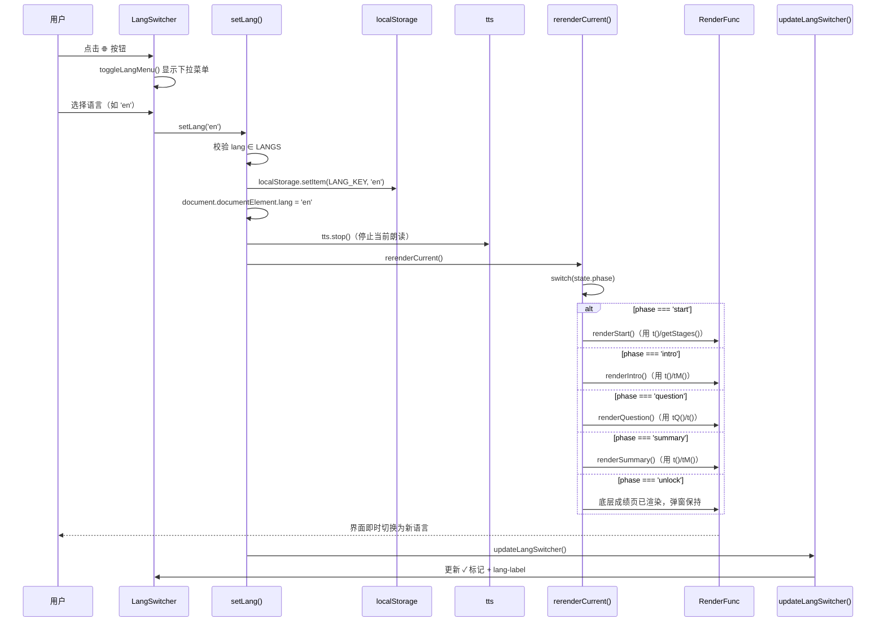
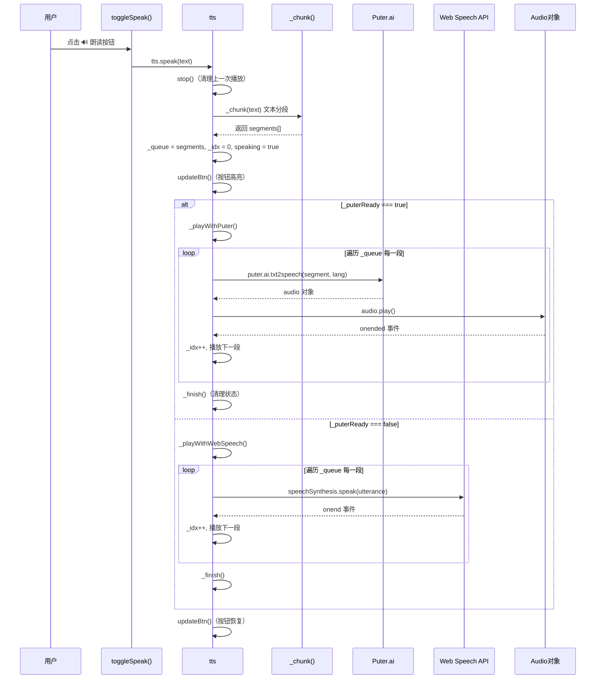
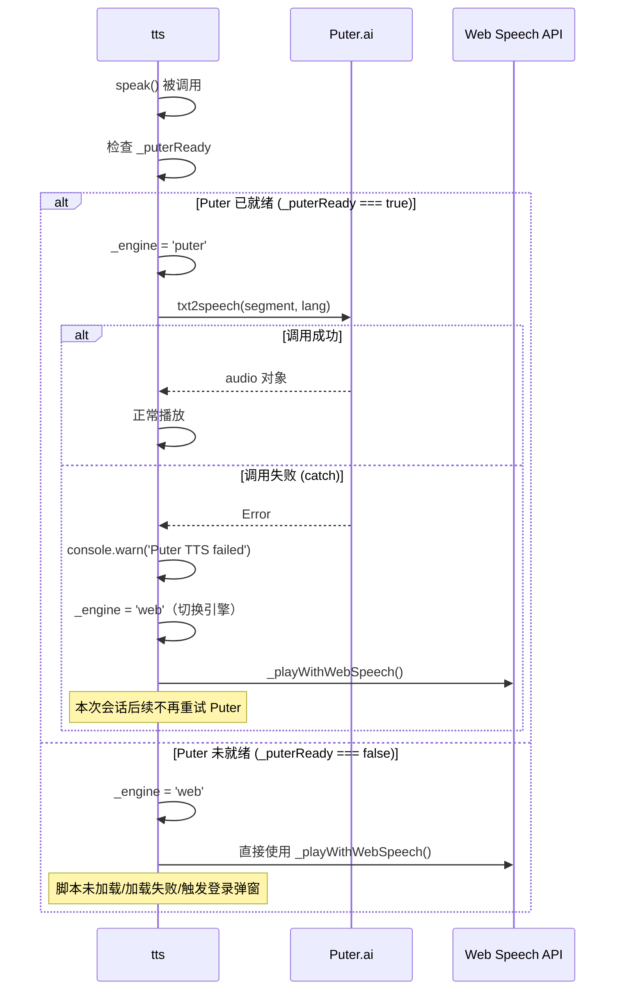
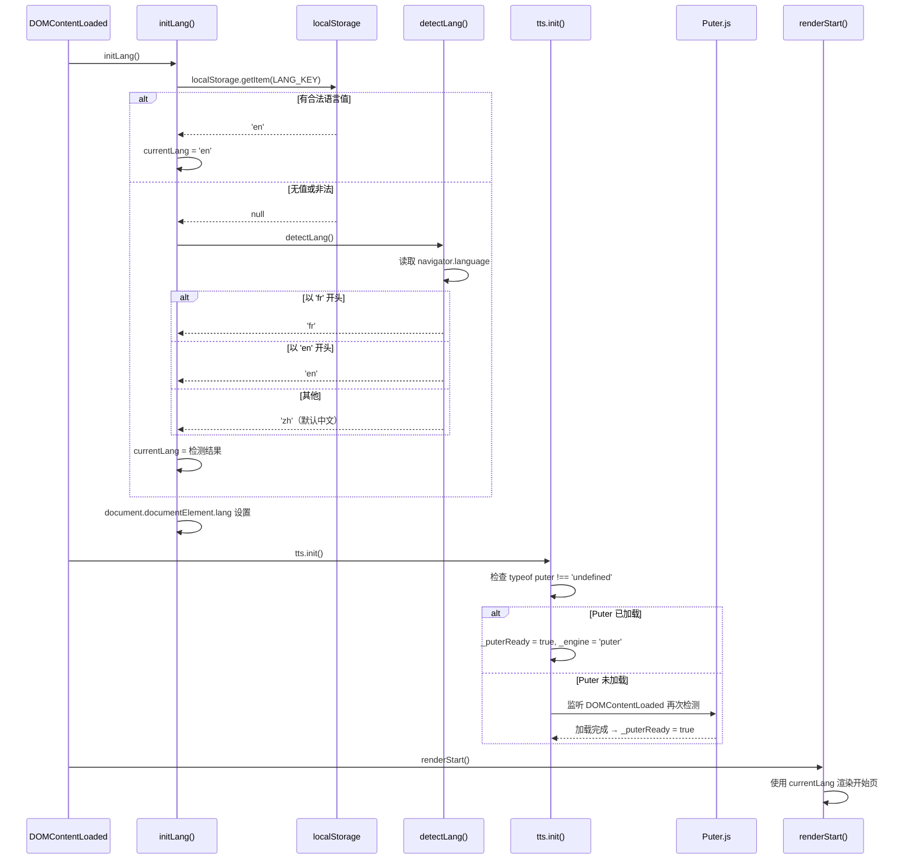
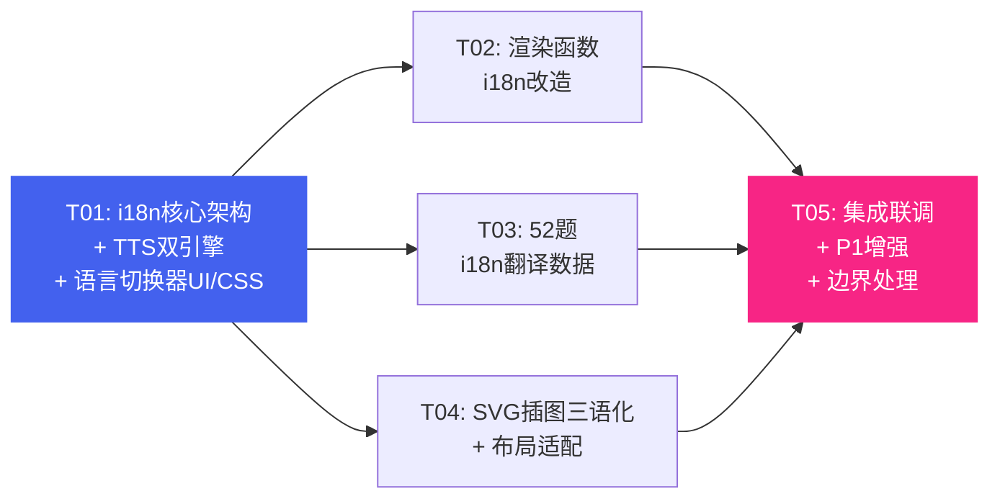

# 系统架构设计：编程小达人 — 国际化（中/英/法三语）+ TTS朗读升级（Puter.js）

> **架构师**：高见远
> **日期**：2026-05-24
> **主文件**：`index.html`（单HTML文件，约3622行）
> **PRD依据**：`prd-i18n-tts.md`（PM许清楚）
> **主理人决策**：10个待确认问题均已决策

---

## A. 实现方案概述

### A.1 框架选型

| 项目 | 选型 | 理由 |
|------|------|------|
| 前端框架 | **保持单HTML无框架** | 现有项目零依赖，i18n通过语言包对象+翻译函数实现，无需引入框架 |
| TTS引擎 | **Puter.js（主）+ Web Speech API（备）** | Puter.js提供更自然的Neural语音；Web Speech API作为零依赖兜底 |
| 脚本加载 | `<script src="https://js.puter.com/v2/" defer>` | `defer`不阻塞首屏渲染，DOMContentLoaded后可用 |
| i18n方案 | **语言包对象 + t()/tQ()/tM() 函数** | 轻量、内联、无外部依赖；中文作为默认/fallback |
| 数据结构 | **增量i18n字段** | 题目/模块/阶段数据保留原中文字段，新增i18n对象存储en/fr翻译，向后兼容 |

### A.2 核心改动策略

**i18n架构（三层翻译函数）**：
- `t(key)` — UI文案翻译（按钮、标题、提示语等80+条）
- `tQ(qIndex, field)` — 题目字段翻译（concept/question/options/explain）
- `tM(moduleIndex, field)` — 模块字段翻译（name/desc）
- `getStages()` — 阶段信息获取（返回当前语言的阶段数组）

**TTS双引擎重构**：
- 引擎选择：`_puterReady` 标志位决定使用Puter还是Web Speech
- 分段队列共用：`_chunk()` 分段逻辑两种引擎共用，`_queue`/`_idx`/`_onEnd` 统一管理
- Fallback策略：Puter调用失败(catch)→切换`_engine='web'`→本会话不再重试Puter
- 语言联动：`_getTTSLang()` 实时读取 `currentLang`，映射到 zh-CN/en-US/fr-FR

**增量翻译策略**：
- 中文保持原字段不变（向后兼容旧代码逻辑）
- 题目新增 `i18n: { en: {...}, fr: {...} }` 字段
- 翻译函数找不到当前语言翻译时自动 fallback 到中文原字段
- code字段完全不翻译（Python伪代码是通用的）

### A.3 关键技术决策

| 决策点 | 方案 | 依据 |
|--------|------|------|
| 语言切换器位置 | 与主题按钮打包为 `.top-controls` 组，浮动在#game右上角 | 主理人决策#6/#7 |
| Puter.js登录弹窗 | 如触发登录弹窗→自动降级到Web Speech API | 主理人决策#1 |
| Puter.js API调用 | 先用默认 `txt2speech(text, lang)`，Neural引擎优化为P1 | 主理人决策#2 |
| code字段翻译 | 完全不翻译（含其中字符串如"小明"） | 主理人决策#3 |
| visual.params | 代码表达式不翻译，纯文字描述翻译，逐题排查 | 主理人决策#4 |
| 翻译实施 | 工程师实施时完成，PM对照表为风格依据 | 主理人决策#5 |
| Puter.js加载 | `defer` 加载，不阻塞首屏 | 主理人决策#8 |
| 文件体积 | 预估+50-80KB可接受，本期内联不分包 | 主理人决策#9 |
| 第3阶标注 | 统一：即将开放 / Coming soon / Bientôt disponible | 主理人决策#10 |

---

## B. 改动区域列表

> 行号基于当前 index.html（约3622行），实施时可能有偏移，以函数名为准。

### B.1 新增区域

| 区域 | 位置 | 内容概述 |
|------|------|----------|
| Puter.js脚本引入 | `<head>` 行8之后 | `<script src="https://js.puter.com/v2/" defer></script>` |
| i18n常量与状态 | `<script>` 开头 行1255之前 | `LANGS`/`currentLang`/`LANG_KEY`/`TTS_LANG_MAP` |
| I18N语言包 | MODULES之前 行1256之前 | UI文案三语对象（80+ key × 3语言） |
| STAGES_I18N对象 | MODULES之后 | 3阶段 × 3语言 |
| MODULES_I18N对象 | MODULES之后 | 12模块 × 3语言（name/desc） |
| i18n翻译函数 | 辅助函数区（state之前） | `t()`/`tQ()`/`tM()`/`getStages()`/`initLang()`/`detectLang()`/`setLang()`/`rerenderCurrent()`/`toggleLangMenu()`/`updateLangSwitcher()` |
| 语言切换器HTML | `<body>` 行1215-1231之间 | `.top-controls` 容器包裹 `.lang-switcher` + `.theme-btn` |
| 语言切换器CSS | `<style>` 行857之后 | `.top-controls`/`.lang-switcher`/`.lang-btn`/`.lang-menu`/`.tts-loading` |
| top-controls布局CSS | `<style>` 行838-857 | 调整 `.theme-btn` 为 `position:static`，新增 `.top-controls` 容器 |
| score-box间距CSS | `<style>` 行117 | `margin-right` 从 `46px` 调整为 `100px` |

### B.2 修改区域

| 函数/区域 | 当前行号 | 改动内容 |
|-----------|----------|----------|
| `<head>` | 行1-8 | 添加Puter.js `<script defer>` |
| `<body>` topbar | 行1234-1238 | moduleTag/scoreBox文案改为 `t()`/`tM()` 调用 |
| `.theme-btn` CSS | 行838-857 | 改为 `.top-controls` 子元素，`position: static` |
| `.score-box` CSS | 行108-118 | `margin-right: 46px` → `100px` |
| `tts` 对象 | 行2319-2414 | **整体重构**为双引擎架构（Puter + Web Speech），详见D节 |
| `toggleSpeak()` | 行2418-2428 | 朗读文本从 `q.concept + q.question` 改为 `tQ(state.qIndex,'concept') + tQ(state.qIndex,'question')` |
| `speakExplain()` | 行2431-2433 | `_explainText` 改为使用 `tQ(state.qIndex,'explain')` |
| `renderStart()` | 行2453-2525 | stages数组→`getStages()`；所有硬编码中文→`t()`；continue-info→`t()` |
| `renderIntro()` | 行2530-2550 | moduleTag→`tM()`；intro-title/desc→`t()`/`tM()`；按钮→`t()` |
| `getAnimHTML()` | 行2553-2621 | SVG标签文字→`t()`（P1） |
| `renderQuestion()` | 行2637-2685 | q-number/concept/question/options/按钮→`tQ()`/`t()`；speakText用`tQ()` |
| `selectOption()` | 行2688-2733 | feedback文案→`t()`；explain→`tQ()`；options text→`tQ()` |
| `renderSummary()` | 行2766-2903 | 所有文案→`t()`/`tM()`；encourage→`t()`；allStages→`getStages()` |
| `renderUnlock()` | 行2908-2988 | 弹窗所有文案→`t()`；stageNames→`getStages()` |
| `getVarVisual()` | 行3222-3254 | SVG `<text>` 标签→`t()`（P1） |
| `getCondVisual()` | 行3257-3294 | SVG `<text>` 标签→`t()`（P1） |
| `getLoopVisual()` | 行3297-3329 | SVG `<text>` 标签→`t()`（P1） |
| `getFuncVisual()` | 行3332-3379 | SVG `<text>` 标签→`t()`（P1） |
| `getBugVisual()` | 行3382-3415 | SVG `<text>` 标签→`t()`（P1） |
| `getReadingVisual()` | 行3423-3459 | SVG `<text>` 标签→`t()`（P1） |
| `getListVisual()` | 行3462-3518 | SVG `<text>` 标签→`t()`（P1） |
| `QUESTIONS` 数组 | 行1358-2194 | 每题增加 `i18n: { en:{...}, fr:{...} }` 字段（52题） |
| 初始化 | 行3616 | `renderStart()` 前调用 `initLang()` |

### B.3 不修改的区域

| 函数/区域 | 行号 | 原因 |
|-----------|------|------|
| `saveProgress()`/`loadProgress()`/`clearProgress()` | 行2221-2254 | 语言单独存储（LANG_KEY），与进度存档无关 |
| `getStageQuestions()`/`getStageModules()`/`getStageStartIndex()` 等 | 行2261-2299 | 纯逻辑函数，不涉及文案 |
| `calcStars()`/`getPassThreshold()` | 行2302-2317 | 纯计算 |
| `_esc()`/`_shade()`/`_sparkle()` 等SVG辅助函数 | 行3044-3219 | 纯工具函数 |
| `toggleTheme()` | 行3606-3611 | 主题切换与语言无关 |
| CSS Token系统 `:root` | 行19-54 | 颜色/间距/圆角token不变 |
| Dark mode变量 `[data-theme="dark"]` | 行780-836 | 变量覆写自动生效，新元素使用token即可 |

---

## C. 数据结构变更

### C.1 全局常量与状态

```javascript
// ---- i18n 常量 ----
var LANGS = ['zh', 'en', 'fr'];           // 支持的语言列表
var currentLang = 'zh';                    // 当前语言（全局状态，默认中文）
var LANG_KEY = 'coding-game-lang';         // localStorage语言偏好键名

// ---- 语言代码 → TTS语言映射 ----
var TTS_LANG_MAP = {
  'zh': 'zh-CN',
  'en': 'en-US',
  'fr': 'fr-FR'
};
```

### C.2 I18N 语言包结构（UI文案）

```javascript
var I18N = {
  zh: {
    // 开始页
    app_title: '编程小达人',
    app_subtitle: '知识闯关 · 3大阶段 · 84道题',
    app_subtitle2: '从认识概念到读懂代码',
    stage_beginner: '入门',
    stage_elementary: '初级',
    stage_intermediate: '中级',
    stage1_desc: '认识5大编程基础概念',
    stage2_desc: '读懂代码，预测运行结果',
    stage3_desc: '综合应用（即将开放）',
    unit_questions: '题',
    passed_badge: '✓ 已通过',
    best_score: '最高 {score}/{total}',
    status_unlocked: '已解锁',
    status_locked: '未解锁',
    continue_info: '上次进度：{stage}阶段 · 第{n}题 · {score}分',
    btn_continue: '继续闯关',
    btn_reselect: '重新选择',
    btn_start: '开始答题',
    // 顶部栏 & 题目页
    unit_score: '分',
    q_number: '第 {n} 题 / 共{total}题',
    btn_next: '下一题',
    btn_view_results: '查看成绩',
    speak_tooltip: '朗读题目',
    speak_explain: '🔊 朗读解析',
    // 选项反馈
    fb_correct_title: '答对了',
    fb_wrong_title: '答错了，没关系',
    fb_summary_label: '知识点小结：',
    fb_explain_label: '解析：',
    fb_correct_answer: '正确答案是',
    // 模块介绍页
    intro_title_prefix: '第 {id} 关：',
    btn_start_quiz: '开始答题',
    // 成绩页
    summary_module_tag: '闯关完成',
    summary_title: '{stage}阶段 闯关完成',
    btn_retry_stage: '重答本阶段',
    btn_back_to_stages: '回阶段选择',
    encourage_s1_3star: '太棒了！你对编程基础概念掌握得非常扎实，可以去挑战初级阶段了！',
    encourage_s1_pass: '恭喜通过入门阶段！正确率达到60%就能解锁初级阶段。再多练几次会更扎实！',
    encourage_s1_fail: '正确率达到60%就能解锁初级阶段，再来一次吧！相信你能做到！',
    encourage_s2_3star: '非常扎实！你的代码阅读能力很强！',
    encourage_s2_pass: '做得不错！大部分代码都能读懂了，继续加油！',
    encourage_s2_low_pass: '通过啦！代码阅读需要练习，多读几遍会更熟练。',
    encourage_s2_fail: '代码阅读需要多练习，把每道题的解析认真读一遍，再来一次会有很大提升！',
    // 解锁弹窗
    unlock_title: '恭喜过关！',
    unlock_score_label: '本阶段成绩：',
    unlock_accuracy: '正确率',
    unlock_unlocked: '已解锁：',
    unlock_go_next: '去{stage}阶段',
    unlock_practice: '再练练',
    // 语言切换器
    lang_tooltip: '切换语言',
    lang_zh: '中文',
    lang_en: 'English',
    lang_fr: 'Français',
    // SVG插图标签（P1）
    svg_var_label: '变量 msg',
    svg_var_hint: '值可以随时替换',
    svg_var_caption: '变量 {name} 里放的是 {value}',
    svg_cond_ask: 'if 下雨?',
    svg_cond_left: '带伞',
    svg_cond_right: '不带',
    svg_cond_true: '条件成立 → 走左边',
    svg_cond_false: '条件不成立 → 走右边',
    svg_loop_hint: '重复执行，无需复制代码',
    svg_loop_lap: '第 {n} 圈',
    svg_loop_caption: '重复执行 {n} 次',
    svg_func_label: '函数',
    svg_func_caption: '函数：原料 → 加工 → 成品',
    svg_func_input: '原料',
    svg_func_output: '成品',
    svg_func_input_param: '参数',
    svg_func_output_return: '返回值',
    svg_bug_fixed: 'Bug 已修复',
    svg_bug_caption: '找虫 · 分析 · 修复 · 验证',
    svg_reading_hint: '从上到下 · 逐行阅读 · 预测结果',
    svg_reading_caption: '读代码 · 理解 · 预测结果',
    svg_list_hint: '有序排列 · 索引从0开始',
    svg_list_caption: '列表 · 有序排列 · 索引从0开始',
    // 阶段总览
    overview_passed: '已通过',
    overview_unlocked: '已解锁',
    overview_locked: '未解锁'
  },
  en: { /* ... 对照表见PRD 6.2节 ... */ },
  fr: { /* ... 对照表见PRD 6.2节 ... */ }
};
```

> **完整三语对照**：工程师直接使用 PRD 第6.2节的对照表填入 en/fr 值。key 命名与上表一致。
>
> **占位符替换约定**：`{score}`/`{total}`/`{n}`/`{stage}`/`{id}`/`{name}`/`{value}` 等占位符在 `t()` 返回后用 `.replace()` 替换。示例：
> ```javascript
> t('q_number').replace('{n}', stageQNum).replace('{total}', stageTotal)
> t('best_score').replace('{score}', score).replace('{total}', st.count)
> ```

### C.3 STAGES_I18N 结构（阶段信息三语）

```javascript
var STAGES_I18N = {
  zh: [
    { id:1, emoji:'🌱', name:'入门', count:22, desc:'认识5大编程基础概念' },
    { id:2, emoji:'📖', name:'初级', count:30, desc:'读懂代码，预测运行结果' },
    { id:3, emoji:'🚀', name:'中级', count:32, desc:'综合应用（即将开放）' }
  ],
  en: [
    { id:1, emoji:'🌱', name:'Beginner', count:22, desc:'Learn 5 core programming concepts' },
    { id:2, emoji:'📖', name:'Elementary', count:30, desc:'Read code, predict the output' },
    { id:3, emoji:'🚀', name:'Intermediate', count:32, desc:'Comprehensive practice (Coming soon)' }
  ],
  fr: [
    { id:1, emoji:'🌱', name:'Débutant', count:22, desc:'Découvrir 5 concepts de base' },
    { id:2, emoji:'📖', name:'Élémentaire', count:30, desc:'Lire le code, prédire le résultat' },
    { id:3, emoji:'🚀', name:'Intermédiaire', count:32, desc:'Pratique globale (Bientôt disponible)' }
  ]
};
```

> `emoji`/`id`/`count` 三语相同，只有 `name`/`desc` 不同。`getStages()` 返回 `STAGES_I18N[currentLang] || STAGES_I18N.zh`。

### C.4 MODULES_I18N 结构（12模块三语）

```javascript
var MODULES_I18N = {
  zh: [
    { name:'变量', desc:'变量就像贴了标签的盒子，用来存放数据。让我们一起来认识它吧！' },
    { name:'条件判断', desc:'如果……就……！条件判断让程序学会做选择，就像走到分叉路口。' },
    // ... 12个模块（name/desc与现有MODULES一致）
  ],
  en: [
    { name:'Variables', desc:"Variables are like labeled boxes for storing data. Let's learn about them!" },
    { name:'Conditionals', desc:'If... then...! Conditionals let programs make choices, like reaching a fork in the road.' },
    // ... 12个模块
  ],
  fr: [
    { name:'Variables', desc:'Les variables sont comme des boîtes étiquetées pour stocker des données. Découvrons-les !' },
    { name:'Conditions', desc:'Si... alors... ! Les conditions permettent au programme de faire des choix, comme à un carrefour.' },
    // ... 12个模块
  ]
};
```

> 完整三语对照见 PRD 6.2.8 节。`MODULES` 原数组保留（emoji/color/anim/id 仍从原数组读取），`tM()` 只负责 name/desc 的翻译。

### C.5 QUESTIONS 数组升级（每题增加 i18n 字段）

```javascript
{
  module: 1,
  visual: { type: 'variable', params: { varName: "x", values: ["8"] } },
  concept: '变量就像一个贴了标签的盒子，可以把数据放进去...',   // 中文（原字段，保留）
  question: '在编程中，"变量"最像下面哪个东西？',              // 中文（原字段，保留）
  code: null,                                                // 不翻译
  options: [                                                 // 中文选项（原字段，保留）
    { letter: 'A', text: '一本书' },
    { letter: 'B', text: '一扇门' },
    { letter: 'C', text: '一个贴了标签的盒子' },
    { letter: 'D', text: '一张地图' }
  ],
  answer: 2,                                                 // 不翻译
  explain: '变量就像一个贴了标签的盒子，可以存放各种数据...',   // 中文（原字段，保留）
  // ===== 新增：多语言字段 =====
  i18n: {
    en: {
      concept: 'A variable is like a labeled box that can store data...',
      question: 'In programming, what is a "variable" most like?',
      options: [
        { letter: 'A', text: 'A book' },
        { letter: 'B', text: 'A door' },
        { letter: 'C', text: 'A labeled box' },
        { letter: 'D', text: 'A map' }
      ],
      explain: 'A variable is like a labeled box that can store various types of data...'
    },
    fr: {
      concept: 'Une variable est comme une boîte étiquetée qui peut stocker des données...',
      question: 'En programmation, à quoi ressemble le plus une « variable » ?',
      options: [
        { letter: 'A', text: 'Un livre' },
        { letter: 'B', text: 'Une porte' },
        { letter: 'C', text: 'Une boîte étiquetée' },
        { letter: 'D', text: 'Une carte' }
      ],
      explain: 'Une variable est comme une boîte étiquetée qui peut stocker divers types de données...'
    }
  }
}
```

**设计要点**：
- `code` 字段不放入 `i18n` — Python伪代码是通用的
- `options[].letter`（A/B/C/D）不翻译
- `answer` 索引不变 — 三语选项顺序一致
- 中文作为默认/fallback — `tQ()` 找不到翻译时回退到原字段
- `visual` 字段不放入 `i18n` — SVG标签翻译在渲染函数中用 `t()` 处理（P1）

### C.6 tts 对象升级（双引擎架构）

```javascript
var tts = {
  speaking: false,
  paused: false,
  _engine: 'web',          // 'puter' | 'web' — 当前使用的引擎
  _puterReady: false,      // Puter.js是否加载完成
  _queue: [],              // 分段队列（两种引擎共用）
  _idx: 0,
  _onEnd: null,
  _currentAudio: null,     // Puter返回的audio对象

  init: function() { /* 检测Puter.js是否可用 */ },
  _getTTSLang: function() { /* 返回TTS_LANG_MAP[currentLang] */ },
  _chunk: function(text) { /* 文本分段，两种引擎共用 */ },
  speak: function(text, onEnd) { /* 入口：分段→选引擎→播放 */ },
  _playWithPuter: function() { /* Puter引擎：逐段txt2speech→audio.play()→onended→下一段 */ },
  _playWithWebSpeech: function() { /* Web Speech引擎：逐段SpeechSynthesisUtterance */ },
  _finish: function() { /* 播放完成清理 */ },
  stop: function() { /* 停止两种引擎的播放 */ },
  toggle: function(text) { /* 暂停/恢复/开始播放 */ },
  updateBtn: function() { /* 更新按钮UI状态 */ }
};
```

> 完整实现代码见 PRD 第5.1节。**注意**：PRD中 `_chunk()` 函数有一处笔误（`finalChunks.push(s.trim())` 应为 `finalChunks.push(c.trim())`），工程师实施时以现有 index.html 行2339的正确代码为准。

### C.7 localStorage 新增

| 键名 | 值 | 说明 |
|------|----|------|
| `coding-game-lang`（LANG_KEY） | `'zh'` / `'en'` / `'fr'` | 语言偏好，独立于进度存档（SAVE_KEY） |

- `initLang()` 初始化时读取：有合法值→使用；无值→`detectLang()` 自动检测
- `setLang()` 切换时写入
- 与 `SAVE_KEY`（进度存档）完全独立，互不影响

---

## D. 程序调用流程

### D.1 语言切换流程



### D.2 TTS朗读流程（双引擎）



### D.3 Fallback 降级流程



### D.4 初始化流程



---

## E. 任务列表（有序、含依赖关系）

### 任务总览

| 任务ID | 任务名称 | 优先级 | 依赖 | 预估改动行数 |
|--------|----------|--------|------|-------------|
| T01 | i18n核心架构 + TTS双引擎 + 语言切换器UI/CSS | P0 | 无 | ~450行新增/修改 |
| T02 | 渲染函数i18n改造（6个渲染函数 + TTS文本调用） | P0 | T01 | ~200行修改 |
| T03 | 52题i18n翻译数据录入 | P0 | T01 | ~1100行新增 |
| T04 | SVG插图标签三语化 + 布局/样式适配 | P1 | T01 | ~150行修改 |
| T05 | 集成联调 + P1增强 + 边界处理 | P0+P1 | T01-T04 | ~80行修改 |

---

### T01: i18n核心架构 + TTS双引擎 + 语言切换器UI/CSS

**任务描述**：搭建i18n基础设施、重构TTS为双引擎架构、添加语言切换器UI和CSS。这是所有后续任务的基础。

**具体改动内容**：

1. **`<head>` 区域**（行8之后）
   - 添加 `<script src="https://js.puter.com/v2/" defer></script>`

2. **`<style>` 区域**
   - 行838-857：将 `.theme-btn` 的 `position: absolute` 改为 `position: static`（作为 `.top-controls` 子元素）
   - 新增 `.top-controls` 样式（absolute, top-right, flex容器，gap: 8px）
   - 新增 `.lang-switcher` / `.lang-btn` / `.lang-menu` / `.lang-menu button` 样式（与 `.theme-btn` 风格统一：44×44px, border + bg, 圆角）
   - 新增 `.tts-loading` 样式（opacity: 0.6, pointer-events: none）
   - 行117：`.score-box` 的 `margin-right: 46px` 改为 `100px`

3. **`<body>` HTML 区域**（行1213-1231之间）
   - 将现有 `.theme-btn` 包裹进 `.top-controls` 容器
   - 在 `.theme-btn` 前添加 `.lang-switcher`（🌐按钮 + 下拉菜单）
   ```html
   <div class="top-controls">
     <div class="lang-switcher">
       <button class="lang-btn" onclick="toggleLangMenu()" title="切换语言">
         <span>🌐</span><span id="langLabel">中</span>
       </button>
       <div class="lang-menu" id="langMenu" style="display:none;">
         <button onclick="setLang('zh')" id="langOptZh">✓ 中文</button>
         <button onclick="setLang('en')" id="langOptEn">&nbsp; English</button>
         <button onclick="setLang('fr')" id="langOptFr">&nbsp; Français</button>
       </div>
     </div>
     <button class="theme-btn" id="themeBtn" ...>...</button>
   </div>
   ```

4. **`<script>` 数据区域**（行1255之前）
   - 新增常量：`LANGS`、`currentLang`、`LANG_KEY`、`TTS_LANG_MAP`
   - 新增 `I18N` 对象（zh/en/fr 三语，key 见 C.2 节，值从 PRD 6.2 节对照表填入）
   - 新增 `STAGES_I18N` 对象（见 C.3 节）
   - 新增 `MODULES_I18N` 对象（见 C.4 节，12模块 × 3语言）

5. **`<script>` 函数区域**（state 定义之前）
   - 新增翻译函数：`t(key)`、`tQ(qIndex, field)`、`tM(moduleIndex, field)`、`getStages()`
   - 新增语言管理函数：`initLang()`、`detectLang()`、`setLang(lang)`、`rerenderCurrent()`、`toggleLangMenu()`、`updateLangSwitcher()`

6. **`tts` 对象重构**（行2319-2414）
   - 整体替换为双引擎架构（见 PRD 5.1 节代码，注意修正 `_chunk()` 中的笔误）
   - 新增属性：`_engine`、`_puterReady`、`_currentAudio`
   - 新增方法：`init()`、`_getTTSLang()`、`_playWithPuter()`、`_playWithWebSpeech()`、`_finish()`
   - 修改 `speak()`：分段后根据 `_puterReady` 选择引擎
   - 修改 `stop()`：同时停止 Puter audio 和 Web Speech
   - 修改 `toggle()`：支持两种引擎的暂停/恢复

7. **初始化区域**（行3616之前）
   - 在 `renderStart()` 之前添加 `initLang();` 和 `tts.init();`

**依赖**：无
**预估改动**：~450行（新增~380行 + 修改~70行）
**风险点**：
- ⚠️ `_chunk()` 函数 PRD 代码有笔误（`s.trim()` 应为 `c.trim()`），必须修正
- ⚠️ Puter.js `txt2speech()` API 签名需实测验证（假设返回 Promise<Audio>）
- ⚠️ `.theme-btn` 从 absolute 改为 static 后，需确保 `.top-controls` 正确定位
- ⚠️ Puter.js 可能在首次调用时弹出认证窗口，`init()` 中检测到 `puter` 对象存在不代表可用

---

### T02: 渲染函数i18n改造（6个渲染函数 + TTS文本调用）

**任务描述**：将所有渲染函数中的硬编码中文替换为 `t()`/`tQ()`/`tM()`/`getStages()` 调用，实现UI文案三语动态切换。

**具体改动内容**：

1. **`renderStart()`**（行2453-2525）
   - `stages` 数组（行2470-2474）→ `var stages = getStages();`
   - `'✓ 已通过'` → `t('passed_badge')`
   - `st.count + '题'` → `st.count + t('unit_questions')`
   - `'最高 ' + score + '/' + st.count` → `t('best_score').replace('{score}', score).replace('{total}', st.count)`
   - `'已解锁'` → `t('status_unlocked')`，`'未解锁'` → `t('status_locked')`
   - continue-info（行2510）→ `t('continue_info').replace('{stage}', stageName).replace('{n}', stageQNum).replace('{score}', save.score)`
   - `'继续闯关'` → `t('btn_continue')`，`'重新选择'` → `t('btn_reselect')`
   - `'编程小达人'` → `t('app_title')`
   - subtitle（行2521）→ `t('app_subtitle') + '<br>' + t('app_subtitle2')`

2. **`renderIntro()`**（行2530-2550）
   - `moduleTag.textContent`（行2535）→ `m.emoji + ' ' + tM(state.moduleIndex, 'name')`
   - `scoreBox.textContent`（行2537）→ `state.score + ' ' + t('unit_score')`
   - `'第 ' + m.id + ' 关：' + m.name`（行2545）→ `t('intro_title_prefix').replace('{id}', m.id) + tM(state.moduleIndex, 'name')`
   - `m.desc`（行2546）→ `tM(state.moduleIndex, 'desc')`
   - `'开始答题'`（行2548）→ `t('btn_start_quiz')`

3. **`renderQuestion()`**（行2637-2685）
   - `moduleTag.textContent`（行2642）→ `m.emoji + ' ' + tM(state.moduleIndex, 'name')`
   - `scoreBox.textContent`（行2643）→ `state.score + ' ' + t('unit_score')`
   - `'第 ' + stageQNum + ' 题 / 共' + stageTotal + '题'`（行2667）→ `t('q_number').replace('{n}', stageQNum).replace('{total}', stageTotal)`
   - `q.concept`（行2668）→ `tQ(state.qIndex, 'concept')`
   - `q.question`（行2670）→ `tQ(state.qIndex, 'question')`
   - `opt.text`（行2658）→ `tQ(state.qIndex, 'options')[i].text`（或循环中用 `tQOpts[i].text`）
   - `'查看成绩'`/`'下一题'`（行2676）→ `t('btn_view_results')`/`t('btn_next')`
   - speakText（行2683）→ `tQ(state.qIndex, 'concept').replace(/<[^>]+>/g,'') + '。' + tQ(state.qIndex, 'question')`

4. **`selectOption()`**（行2688-2733）
   - `scoreBox.textContent`（行2716）→ `state.score + ' ' + t('unit_score')`
   - `_explainText`（行2711）→ `tQ(state.qIndex, 'explain').replace(/<[^>]+>/g,'').replace(/&[a-z]+;/g,'')`
   - `'答对了'`（行2719）→ `t('fb_correct_title')`
   - `'知识点小结：'`（行2720）→ `t('fb_summary_label')`
   - `q.explain`（行2720）→ `tQ(state.qIndex, 'explain')`
   - `'🔊 朗读解析'`（行2721）→ `t('speak_explain')`
   - `'答错了，没关系'`（行2726）→ `t('fb_wrong_title')`
   - `'正确答案是'`（行2727）→ `t('fb_correct_answer')`
   - `correctText`（行2724）→ `tQ(state.qIndex, 'options')[correctIdx].text`
   - `'解析：'`（行2728）→ `t('fb_explain_label')`

5. **`renderSummary()`**（行2766-2903）
   - `moduleTag.textContent`（行2804）→ `t('summary_module_tag')`
   - `scoreBox.textContent`（行2805）→ `state.score + ' ' + t('unit_score')`
   - `allStages` 数组（行2829-2833）→ `getStages()`
   - `m.name`（行2821）→ `tM(MODULES.indexOf(m), 'name')`
   - `'已通过'`/`'已解锁'`/`'未解锁'`（行2848/2853/2857）→ `t('overview_passed')`/`t('overview_unlocked')`/`t('overview_locked')`
   - encourage 逻辑（行2863-2873）→ `t('encourage_s1_3star')` / `t('encourage_s1_pass')` / `t('encourage_s1_fail')` / `t('encourage_s2_3star')` / `t('encourage_s2_pass')` / `t('encourage_s2_low_pass')` / `t('encourage_s2_fail')`
   - `stageName`（行2875）→ `getStages()[state.stage - 1].name`
   - `stageName + '阶段 闯关完成'`（行2880）→ `t('summary_title').replace('{stage}', stageName)`
   - `'重答本阶段'`（行2887）→ `t('btn_retry_stage')`
   - `'回阶段选择'`（行2888）→ `t('btn_back_to_stages')`

6. **`renderUnlock()`**（行2908-2988）
   - `stageNames`（行2911）→ 从 `getStages()` 获取
   - `'恭喜过关！'`（行2956）→ `t('unlock_title')`
   - `'本阶段成绩：'`（行2957）→ `t('unlock_score_label')`
   - `'正确率'`（行2959）→ `t('unlock_accuracy')`
   - `'已解锁：' + nextName + '阶段'`（行2960）→ `t('unlock_unlocked') + nextName`
   - `'去' + nextName + '阶段'`（行2962）→ `t('unlock_go_next').replace('{stage}', nextName)`
   - `'再练练'`（行2963）→ `t('unlock_practice')`

7. **`toggleSpeak()` / `speakExplain()`**（行2418-2433）
   - `toggleSpeak()`：`q.concept` → `tQ(state.qIndex, 'concept')`，`q.question` → `tQ(state.qIndex, 'question')`
   - `speakExplain()`：无需改动（`_explainText` 已在 `selectOption()` 中用 `tQ()` 赋值）

8. **topbar 元素**（行1234-1238）
   - `moduleTag` 初始文本 `'模块'` → 保留（会被渲染函数覆盖）
   - `scoreBox` 初始文本 `'0 分'` → 保留（会被渲染函数覆盖）
   - `speakBtn` 的 `title="朗读题目"` → `title=""` + JS 中 `btn.setAttribute('title', t('speak_tooltip'))` 或直接保留

**依赖**：T01（需要 t/tQ/tM/getStages/setLang 等函数和 I18N/MODULES_I18N/STAGES_I18N 数据）
**预估改动**：~200行修改（约80处文案替换）
**风险点**：
- ⚠️ `tQ(state.qIndex, 'options')` 返回数组，需确认每次调用返回同一引用或改为缓存
- ⚠️ 占位符替换顺序：`{stage}` 可能与阶段名中的字符冲突（概率低但需注意）
- ⚠️ `renderSummary()` 中的 `allStages` 与 `renderStart()` 中的 `stages` 都要改为 `getStages()`
- ⚠️ `selectOption()` 中 `tQ(state.qIndex, 'options')` 返回翻译后的选项数组，需正确取 `correctIdx`

---

### T03: 52题i18n翻译数据录入

**任务描述**：为52道题目的 `concept`/`question`/`options[].text`/`explain` 四个字段添加 en/fr 翻译，共416条翻译（52题 × 4字段 × 2外语）。这是本需求最大的工作量。

**翻译组织策略**：

采用 **「按模块分批 × 按语言分批」** 的二维分批策略：

| 批次 | 范围 | 语言 | 题数 | 翻译条数 | 预估新增行数 |
|------|------|------|------|----------|-------------|
| Batch 1 | 模块1-5（第1阶） | English | 22题 | 88条 | ~250行 |
| Batch 2 | 模块1-5（第1阶） | Français | 22题 | 88条 | ~250行 |
| Batch 3 | 模块6-12（第2阶） | English | 30题 | 120条 | ~300行 |
| Batch 4 | 模块6-12（第2阶） | Français | 30题 | 120条 | ~300行 |

**实施方法**：

每批按模块粒度用 Edit 工具操作：
1. 读取该模块在 QUESTIONS 数组中的题目区域
2. 为每道题的 `explain` 字段后（即题目对象的 `}` 前）插入 `i18n: { en: {...}, fr: {...} }` 字段
3. 用 Edit 工具替换该模块的题目区域

**示例**（模块1，第1题）：

```javascript
// Edit: old_string 为题目1的结束部分
    explain: '变量就像一个贴了标签的盒子，可以存放各种数据，随时取用或更换里面的内容。'
  },

// Edit: new_string 添加 i18n 字段
    explain: '变量就像一个贴了标签的盒子，可以存放各种数据，随时取用或更换里面的内容。',
    i18n: {
      en: {
        concept: 'A variable is like a labeled box that can store data, take it out when needed, and change its content anytime.',
        question: 'In programming, what is a "variable" most like?',
        options: [
          { letter: 'A', text: 'A book' },
          { letter: 'B', text: 'A door' },
          { letter: 'C', text: 'A labeled box' },
          { letter: 'D', text: 'A map' }
        ],
        explain: 'A variable is like a labeled box that can store various types of data, accessible and changeable anytime.'
      },
      fr: {
        concept: 'Une variable est comme une boîte étiquetée qui peut stocker des données, les récupérer au besoin et changer son contenu à tout moment.',
        question: 'En programmation, à quoi ressemble le plus une « variable » ?',
        options: [
          { letter: 'A', text: 'Un livre' },
          { letter: 'B', text: 'Une porte' },
          { letter: 'C', text: 'Une boîte étiquetée' },
          { letter: 'D', text: 'Une carte' }
        ],
        explain: 'Une variable est comme une boîte étiquetée qui peut stocker divers types de données, accessibles et modifiables à tout moment.'
      }
    }
  },
```

**翻译规则**（遵循 PRD 6.1 风格指南）：
- 面向小学生：用词简单，避免学术化
- 口语化：像老师对学生说话，亲切自然
- Python关键字保留英文：`if`/`else`/`for`/`while`/`def`/`return`/`print` 不翻译
- 鼓励语积极：多用鼓励性表达
- 法语自然：注意阴阳性、冠词
- code字段不翻译（含其中字符串如"小明"）
- options三语顺序一致，answer索引不变
- visual.params中代码表达式不翻译，纯文字描述翻译（逐题排查，在T04中处理SVG标签时一并处理）

**模块题目分布**（供工程师规划批次）：

| 模块 | 名称 | 题目数 | 阶段 |
|------|------|--------|------|
| 1 | 变量 | 4 | 第1阶 |
| 2 | 条件判断 | 3 | 第1阶 |
| 3 | 循环 | 4 | 第1阶 |
| 4 | 函数 | 4 | 第1阶 |
| 5 | 调试思维 | 7 | 第1阶 |
| 6 | 代码阅读基础 | 6 | 第2阶 |
| 7 | 变量进阶 | 5 | 第2阶 |
| 8 | 条件进阶 | 5 | 第2阶 |
| 9 | 循环进阶 | 5 | 第2阶 |
| 10 | 函数进阶 | 5 | 第2阶 |
| 11 | 列表入门 | 3 | 第2阶 |
| 12 | 综合小案例 | 1 | 第2阶 |

**依赖**：T01（需要 `tQ()` 函数验证翻译数据正确性）
**预估改动**：~1100行新增
**风险点**：
- ⚠️ 翻译工作量大（416条），建议分4批实施，每批完成后验证
- ⚠️ 法语特殊字符（é/è/ê/ç/à/«»）需确保HTML编码正确
- ⚠️ 部分题目含HTML标签（如 `<span class="kw">`），翻译时需保留标签结构
- ⚠️ Edit 操作需精确匹配 old_string，建议每次操作一个模块的题目区域

---

### T04: SVG插图标签三语化 + 布局/样式适配

**任务描述**：将SVG动画和插图中的中文标签替换为 `t()` 调用（P1），调整topbar布局适配语言切换器，处理dark mode和移动端响应式。

**具体改动内容**：

1. **`getAnimHTML()` 7个动画模板**（行2553-2621）
   - variable: `'变量 msg'` → `t('svg_var_label')`；`'值可以随时替换'` → `t('svg_var_hint')`
   - condition: `'if 下雨?'` → `t('svg_cond_ask')`；`'带伞'` → `t('svg_cond_left')`；`'不带'` → `t('svg_cond_right')`
   - loop: `'重复执行，无需复制代码'` → `t('svg_loop_hint')`
   - bug: `'Bug 已修复'` → `t('svg_bug_fixed')`
   - reading: `'从上到下 · 逐行阅读 · 预测结果'` → `t('svg_reading_hint')`（注：代码块中的"小明"不翻译）
   - list: `'苹果'`/`'香蕉'`/`'橘子'` → 需翻译；`'有序排列 · 索引从0开始'` → `t('svg_list_hint')`

2. **7个 getXXXVisual 函数**（行3222-3518）
   - `getVarVisual()`：`'变量 ' + vn + ' 里放的是 ' + v` → `t('svg_var_caption').replace('{name}', vn).replace('{value}', v)`
   - `getCondVisual()`：`'条件成立 → 走左边'`/`'条件不成立 → 走右边'` → `t('svg_cond_true')`/`t('svg_cond_false')`
   - `getLoopVisual()`：`'第 ' + n + ' 圈'` → `t('svg_loop_lap').replace('{n}', n)`；`'重复执行 ' + n + ' 次'` → `t('svg_loop_caption').replace('{n}', n)`
   - `getFuncVisual()`：`inp`/`out` 参数翻译 — 当值为"原料"/"成品"/"参数"/"返回值"时用 `t()` 替换；`'函数：原料 → 加工 → 成品'` → `t('svg_func_caption')`
   - `getBugVisual()`：`'找虫 · 分析 · 修复 · 验证'` → `t('svg_bug_caption')`
   - `getReadingVisual()`：`'读代码 · 理解 · 预测结果'` → `t('svg_reading_caption')`
   - `getListVisual()`：`items` 参数中的文字（如"苹果"/"香蕉"）需翻译；`'列表 · 有序排列 · 索引从0开始'` → `t('svg_list_caption')`

3. **visual.params 文字翻译处理**
   - `getFuncVisual()` 的 `input`/`output` 参数：已知值映射
     ```javascript
     var inputTr = t('svg_func_input'); // 默认'原料'
     if (inp === '参数') inputTr = t('svg_func_input_param');
     // output 同理
     ```
   - `getListVisual()` 的 `items` 参数：若items为已知中文词（苹果/香蕉/橘子等），用 `t()` 翻译；若为代码值（A/B/C/数字），不翻译
   - `getVarVisual()` 的 `values` 参数：代码值不翻译

4. **布局/样式适配**
   - `.score-box` margin-right: `46px` → `100px`（为 `.top-controls` 留空间）
   - `.top-controls` dark mode 适配：子元素使用 CSS token 自动适配
   - `.lang-menu` dark mode：`background: var(--c-surface)` / `border: var(--c-border)` 自动适配
   - 移动端响应式：`@media (max-width: 600px)` 下 `.lang-btn` 隐藏文字标签只显示 🌐 图标

**依赖**：T01（需要 `t()` 函数和 SVG 标签 key）
**预估改动**：~150行修改
**风险点**：
- ⚠️ `getFuncVisual()` 的 input/output 参数需要判断是文字还是代码值，逻辑较复杂
- ⚠️ `getListVisual()` 的 items 翻译可能影响布局（法语单词更长）
- ⚠️ 动画中的代码展示（如 reading 动画的 `"小明"`）不翻译，需区分代码内容和说明文字

---

### T05: 集成联调 + P1增强 + 边界处理

**任务描述**：全链路集成测试、P1功能增强（自动语言检测/loading状态）、localStorage向后兼容、三语完整性扫描、TTS双引擎集成验证。

**具体改动内容**：

1. **初始化联调**
   - 确认 `initLang()` 在 `renderStart()` 之前调用
   - 确认 `tts.init()` 在页面加载后执行
   - 确认 `window.tts = tts` 赋值保留（行3617）

2. **localStorage 向后兼容**
   - 旧用户无 `LANG_KEY` → `initLang()` 自动检测浏览器语言
   - 旧进度存档（SAVE_KEY）不受影响 → 语言与进度完全独立
   - 验证：切换语言后刷新页面，语言偏好保留，进度不丢失

3. **三语完整性扫描**
   - 逐页检查（start/intro/question/summary/unlock）三语切换无遗漏
   - 搜索代码中残留的硬编码中文字符串（如 `'分'`、`'题'`、`'阶段'` 等）
   - 验证所有 `t()` 调用的 key 在三语包中都存在

4. **TTS双引擎集成验证**
   - 在线场景：Puter.js加载成功 → 朗读使用Neural语音
   - 离线场景：断网后 Puter.js加载失败 → 自动降级到Web Speech API
   - Puter调用失败场景：模拟 `txt2speech()` reject → 降级到Web Speech API
   - 语言切换时TTS联动：切换语言 → `tts.stop()` → 下次朗读使用新语言
   - iOS分段队列：验证长文本分段播放正常（两种引擎）

5. **P1功能增强**
   - 自动语言检测（`detectLang()`）：已在T01中实现，此处验证
   - TTS loading状态：Puter首次调用时显示loading → `audio.play()` 成功后移除
     ```javascript
     // 在 _playWithPuter() 中：
     this._showLoading(); // 添加 .tts-loading class
     puter.ai.txt2speech(text, lang).then(function(audio) {
       self._hideLoading(); // 移除 .tts-loading class
       audio.play();
     })
     ```
   - Puter.js Neural引擎优化（P1）：暂不实现，保留扩展空间

6. **移动端验证**
   - 语言切换器在移动端（<600px）显示为图标
   - topbar 在小屏幕下不溢出（module-tag + speak-btn + score-box + top-controls）
   - SVG插图在三语下不溢出（法语单词可能更长）

7. **dark mode 验证**
   - 语言切换器/下拉菜单在dark mode下颜色正确
   - tts-loading 状态在dark mode下可见

**依赖**：T01、T02、T03、T04（全部完成后进行集成测试）
**预估改动**：~80行修改（主要是修复遗漏 + P1增强代码）
**风险点**：
- ⚠️ 三语完整性扫描需要逐页手动切换检查，耗时较长
- ⚠️ Puter.js 实际API行为可能与预期不同（登录弹窗、返回格式等），需实测
- ⚠️ iOS Safari 的 Web Speech API 和 Audio 对象行为有差异，需真机测试

---

### 任务依赖图



**并行策略**：T02、T03、T04 均只依赖 T01，可并行实施。T03（翻译数据）与 T02（渲染函数改造）互不依赖，可同时进行。T04（SVG标签）与 T02（渲染函数）虽然都改渲染相关代码，但改动的函数不重叠（T04改 getAnimHTML/getXXXVisual，T02改 renderXXX），可并行。

---

## F. 共享知识（跨区域约定）

### F.1 i18n 函数命名规范

| 函数 | 签名 | 用途 | Fallback 策略 |
|------|------|------|--------------|
| `t(key)` | `t('app_title')` → `String` | UI文案翻译 | `I18N[currentLang][key]` → `I18N.zh[key]` → `key` 本身 |
| `tQ(qIndex, field)` | `tQ(0, 'concept')` → `String` | 题目字段翻译 | `q.i18n[currentLang][field]` → `q[field]`（中文原字段） |
| `tQ(qIndex, 'options')` | `tQ(0, 'options')` → `Array` | 题目选项数组翻译 | `q.i18n[currentLang].options` → `q.options`（中文原数组） |
| `tM(moduleIndex, field)` | `tM(0, 'name')` → `String` | 模块字段翻译 | `MODULES_I18N[currentLang][idx][field]` → `MODULES_I18N.zh[idx][field]` |
| `getStages()` | `getStages()` → `Array` | 获取当前语言阶段数组 | `STAGES_I18N[currentLang]` → `STAGES_I18N.zh` |

### F.2 占位符替换约定

`{score}`/`{total}`/`{n}`/`{stage}`/`{id}`/`{name}`/`{value}` 等占位符在 `t()` 返回后用链式 `.replace()` 替换：

```javascript
// 正确示例
t('q_number').replace('{n}', stageQNum).replace('{total}', stageTotal)
t('best_score').replace('{score}', score).replace('{total}', st.count)
t('continue_info').replace('{stage}', stageName).replace('{n}', stageQNum).replace('{score}', save.score)
```

### F.3 CSS class 复用约定

- `.lang-btn` 与 `.theme-btn` 风格统一：44×44px, `border: 1.5px solid var(--c-border)`, `border-radius: var(--r-md)`, `background: var(--c-bg)`
- `.lang-menu` 下拉菜单：`position: absolute`, `background: var(--c-surface)`, `border: 1px solid var(--c-border)`, `box-shadow: var(--shadow-lift)`, `z-index: 20`
- `.tts-loading` 与 `.speak-btn.speaking` 共用 opacity 变化模式
- 所有新元素使用 CSS token（`--c-bg`/`--c-surface`/`--c-border`/`--c-text-2` 等），自动适配 dark mode
- `.top-controls` 容器：`position: absolute; top: 14px; right: var(--sp-lg); display: flex; gap: var(--sp-sm); z-index: 10;`

### F.4 TTS 双引擎状态管理约定

| 属性 | 含义 | 生命周期 |
|------|------|----------|
| `_engine` | 当前使用的引擎（`'puter'`/`'web'`） | 初始化时设为 `'web'`；Puter就绪后设为 `'puter'`；Puter失败后设为 `'web'`（本会话不再切回） |
| `_puterReady` | Puter.js是否可用 | `init()` 时检测；一旦设为 `false`，不再重检 |
| `_currentAudio` | Puter返回的Audio对象 | 每次 `_playWithPuter()` 更新；`stop()`/`_finish()` 时置 null |
| `_queue`/`_idx`/`_onEnd` | 分段队列状态 | 两种引擎共用，`speak()` 时初始化，`_finish()` 时清理 |

**关键约定**：一旦 Puter 调用失败(catch)，`_engine` 切换为 `'web'` 且本会话不再切回 Puter。这避免了每次朗读都尝试 Puter 再失败的抖动。

### F.5 代码风格约定

- **字符串拼接**：使用 `+` 拼接（与现有代码一致），不使用模板字面量 `` ` ``
- **变量声明**：使用 `var`（与现有代码一致），不使用 `let`/`const`
- **函数声明**：使用 `function` 关键字（与现有代码一致），不使用箭头函数
- **HTML转义**：SVG `<text>` 中的动态内容使用 `_esc()` 函数转义
- **注释风格**：`/* ... */` 块注释分隔功能区，`//` 单行注释解释逻辑

### F.6 颜色 token 使用约定

| Token | 用途 | 新元素使用场景 |
|-------|------|--------------|
| `--c-bg` | 页面背景 | `.lang-btn` 背景 |
| `--c-surface` | 卡片/弹窗背景 | `.lang-menu` 背景 |
| `--c-border` | 边框 | `.lang-btn`/`.lang-menu` 边框 |
| `--c-text-2` | 次文字 | `.lang-btn` 文字颜色 |
| `--c-text-3` | 辅助说明 | SVG caption 文字颜色 |
| `--shadow-lift` | 浮层阴影 | `.lang-menu` 阴影 |
| `--r-md` | 中圆角 | `.lang-btn` 圆角 |

---

## G. 待明确事项

### G.1 Puter.js API 实测验证（实施前需确认）

| # | 待验证项 | 影响 | 验证方法 |
|---|---------|------|----------|
| 1 | `puter.ai.txt2speech(text, lang)` 的参数签名 | T01 TTS实现 | 浏览器控制台调用测试 |
| 2 | `txt2speech()` 返回值是 Promise<Audio> 还是 Audio？ | T01 TTS实现 | 控制台 `typeof` 检查 |
| 3 | 首次调用是否弹出 Puter 登录窗口？ | T01 init逻辑 | 隐身窗口测试 |
| 4 | 返回的 Audio 对象是否标准 HTMLAudioElement？ | T01 onended/onerror | 控制台检查原型链 |
| 5 | Neural引擎是否需要额外参数？ | T05 P1增强 | 查阅 Puter.js 文档 |

### G.2 假设

1. **假设** Puter.js `txt2speech(text, lang)` 返回 `Promise<HTMLAudioElement>`，支持 `play()`/`pause()`/`onended`/`onerror`。若实际不同，T01中 `_playWithPuter()` 需调整。
2. **假设** Puter.js 用 `defer` 加载后，在 `DOMContentLoaded` 时 `typeof puter !== 'undefined'`。若加载更慢，`tts.init()` 中的 DOMContentLoaded 监听会兜底。
3. **假设** 现有 `_chunk()` 分段逻辑对英法语文本同样有效（按 `.!?` 分句）。实际上法语问号前有空格（`?` → ` ?`），可能影响分段，但不影响功能正确性。
4. **假设** 52题翻译由工程师完成，PM对照表作为风格依据。翻译质量由QA抽查。
5. **假设** `visual.params` 中需要翻译的文字仅出现在 function（input/output）和 list（items）两类插图中，其他类型的 params 均为代码值或数字。

### G.3 性能预估

| 项目 | 预估值 | 说明 |
|------|--------|------|
| I18N语言包 | ~15KB | 80+ key × 3语言，纯文本 |
| MODULES_I18N + STAGES_I18N | ~5KB | 12+3条 × 3语言 |
| 52题i18n字段 | ~50-60KB | 52题 × 4字段 × 2语言 |
| Puter.js脚本 | ~200KB（外部） | defer加载，不阻塞首屏 |
| **合计新增** | **~70-80KB** | 在主理人决策#9的可接受范围内 |

---

## 附录：文件输出清单

| 文件 | 内容 |
|------|------|
| `architecture-i18n-tts.md` | 本文档（完整架构设计+任务分解） |
| `docs/sequence-diagram.mermaid` | D节时序图（语言切换/TTS朗读/Fallback降级/初始化） |
| `docs/class-diagram.mermaid` | 数据结构关系图 |
