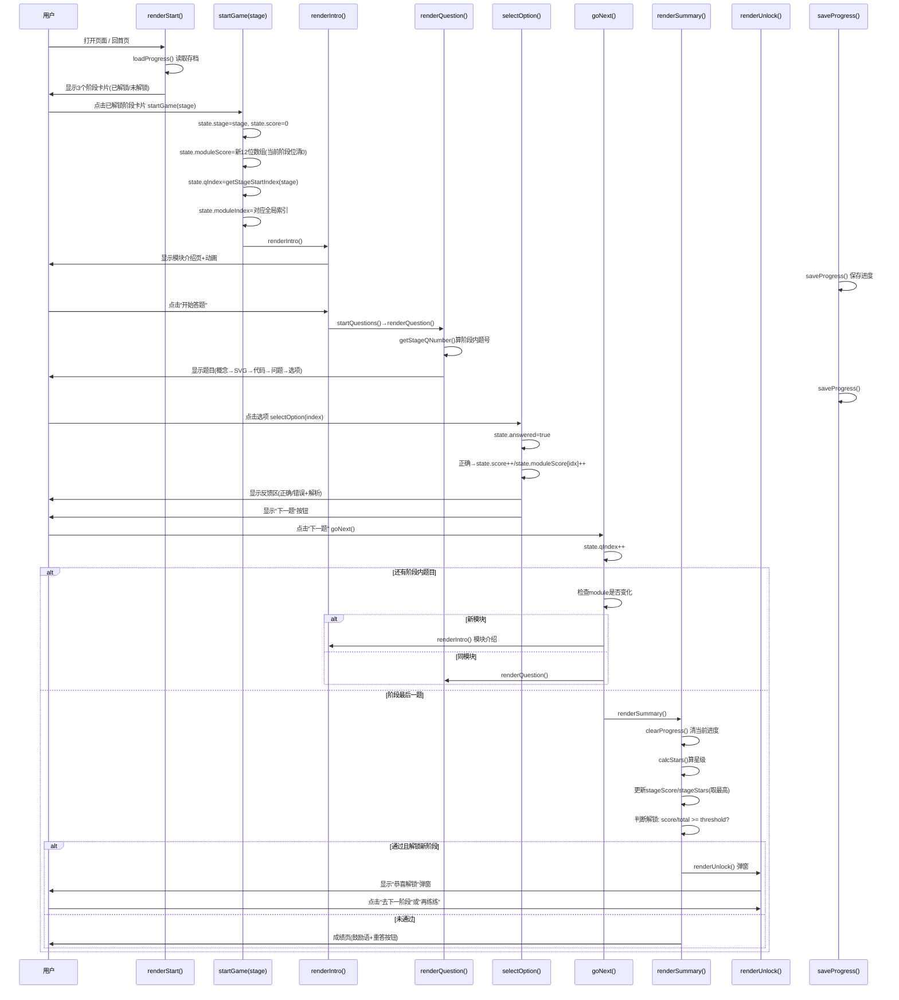
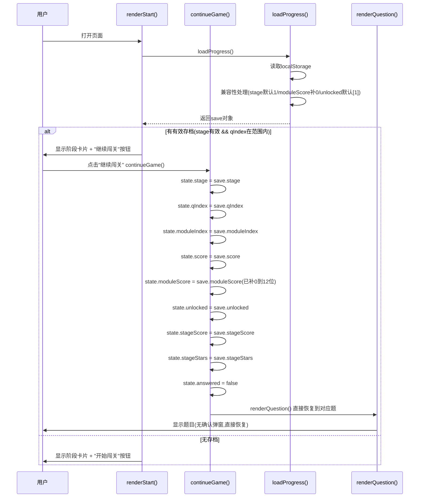
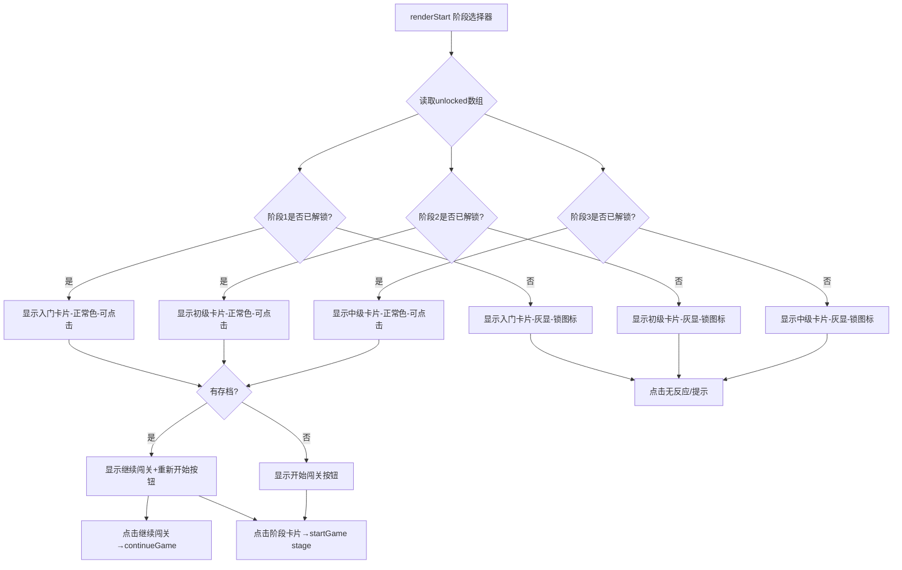
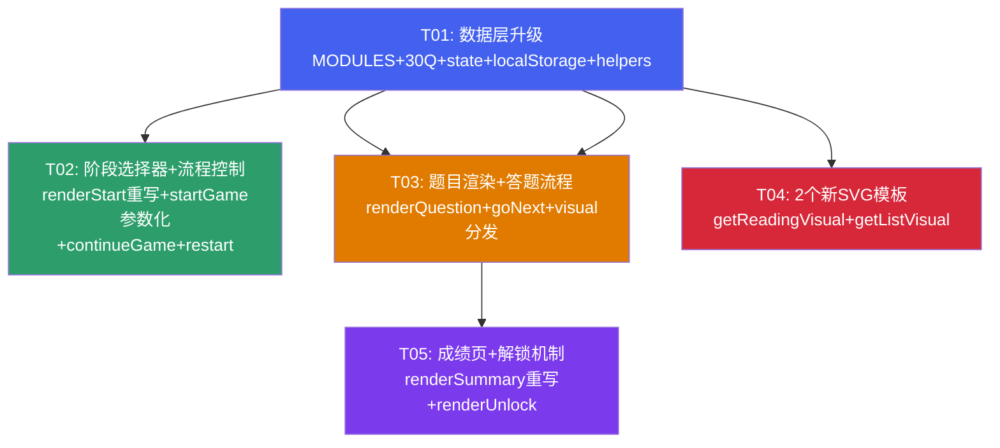

# 编程小达人 — 第2阶（初级）增量 系统架构设计

> **架构师**：高见远
> **日期**：2026-05-24
> **基于**：PRD v1.0（许清楚）+ 现有 index.html（2297行，第1阶已上线）
> **项目类型**：单 HTML 文件（HTML + CSS + JS，零外部依赖）

---

## A. 实现方案概述

### A.1 框架选型

**保持现有技术栈不变**：单 HTML 文件，纯原生 JS + 内联 CSS，无任何外部依赖（无 React/Vue/jQuery）。这是本项目的核心约束，第2阶增量严格沿用。

### A.2 核心改动策略

**增量修改，绝不破坏第1阶现有功能**。具体策略：

1. **数据层追加**：MODULES 数组在现有5个模块后 `push` 7个新模块（id 6-12）；QUESTIONS 数组在现有22题后追加30题。现有22题 **不修改**（不补 `stage` 字段），通过 `getStageQuestions()` 中 `q.stage || 1` 兼容。
2. **state 扩展**：在现有 state 对象上新增 `stage`/`stageScore`/`stageStars` 字段，`moduleScore` 数组从5位扩展到12位。`loadProgress()` 做向后兼容（旧5位数组自动补0到12位）。
3. **渲染层重写**：`renderStart()` 改为阶段选择器；`renderSummary()` 重写为3星制+阶段总览+解锁判断。其余渲染函数（renderQuestion/renderIntro）做微调而非重写。
4. **SVG 复用**：2个新模板 `getReadingVisual()`/`getListVisual()` 严格遵循现有模式——`_robot()` helper 复用 + `Math.random()` 生成唯一渐变ID。
5. **CSS 追加**：新增阶段卡片、锁图标、解锁弹窗、星级样式，全部使用现有 CSS Token 系统（`var(--c-*)`），确保 dark mode 自动适配。

### A.3 关键技术决策

| 决策点 | 方案 | 理由 |
|--------|------|------|
| 题目分阶段过滤 | `QUESTIONS.filter(q => (q.stage\|\|1) === stage)` | 不改现有22题数据，零风险 |
| moduleScore 扩展 | 5位→12位，loadProgress 兼容补0 | 向后兼容旧存档 |
| 阶段间导航 | 阶段选择器为枢纽，成绩页"回首页"回到选择器 | 用户故事US2 |
| 续玩恢复 | 直接恢复到存档 stage+qIndex，无确认弹窗 | 已决策问题8 |
| 星级评价 | 3星制（≥90%→3星 / ≥70%→2星 / ≥60%→1星 / <60%→0星） | PRD P1-1，第1阶5星制改为3星制统一 |
| 阶段最高分 | stageScore 取历史最高，不降级 | 已决策问题4 |
| 第3阶显示 | 灰显+锁图标，不可点击 | 已决策问题6 |

---

## B. 改动区域列表（按代码区域划分）

> 行号基于当前 index.html（2297行）。工程师实施时行号会因插入内容而偏移，以**函数名+锚点**为准。

| # | 区域 | 当前行号 | 改动类型 | 改动概述 |
|---|------|---------|---------|---------|
| B1 | CSS 样式区 | 9-898 | **追加** | 新增阶段选择器卡片样式、锁图标、解锁弹窗、阶段总览卡片、3星制样式（约80行CSS） |
| B2 | MODULES 数组 | 945-986 | **追加** | 在 `]` 前追加7个模块对象（id 6-12） |
| B3 | QUESTIONS 数组 | 990-1330 | **追加** | 在 `];` 前追加30道第2阶题目（每题含 `stage:2`） |
| B4 | state 对象 | 1335-1342 | **修改** | 新增 `stage`/`stageScore`/`stageStars` 字段，moduleScore 扩展为12位 |
| B5 | saveProgress() | 1353-1362 | **修改** | 增加 stage/unlocked/stageScore/stageStars 字段写入 |
| B6 | loadProgress() | 1364-1370 | **修改** | 兼容旧格式：无stage默认1，moduleScore补0到12位，无unlocked默认[1] |
| B7 | clearProgress() | 1371-1373 | **不变** | — |
| B8 | 新增 stage helpers | 1330后(B3后) | **新增** | `getStageQuestions(stage)` + `getStageModules(stage)` |
| B9 | continueGame() | 1491-1500 | **修改** | 从存档恢复时设置 state.stage，加载对应阶段题目，moduleIndex 修正 |
| B10 | renderStart() | 1505-1540 | **重写** | 改为阶段选择器：3个阶段卡片（入门/初级/中级），已解锁可点击，未解锁灰显+锁 |
| B11 | renderIntro() | 1545-1565 | **微调** | 模块介绍标题"第N关"→保持，但 moduleIndex 需基于阶段内偏移 |
| B12 | getAnimHTML() | 1568-1613 | **追加** | 新增 'reading'/'list' 两个 case（可选，因 intro 页面也可以复用现有） |
| B13 | renderQuestion() | 1629-1672 | **修改** | 题号显示改为"阶段内题号/阶段总题数"；moduleIndex 基于全局MODULES索引 |
| B14 | selectOption() | 1675-1720 | **微调** | moduleScore 索引需用全局 module-1（已正确，因 moduleIndex 是全局索引） |
| B15 | goNext() | 1723-1739 | **修改** | 阶段内题目切换：用 getStageQuestions 过滤，最后一题后 renderSummary |
| B16 | updateProgress() | 1742-1745 | **修改** | 进度条按阶段内进度计算 |
| B17 | renderSummary() | 1750-1810 | **重写** | 3星制 + 阶段总览卡片 + 解锁判断 + 两个按钮（重答本阶段/回阶段选择器） |
| B18 | 新增 renderUnlock() | — | **新增** | 解锁提示弹窗（模态层） |
| B19 | getDefaultVisual() | 1817-1827 | **修改** | switch 增加 module 6-12 的默认 visual |
| B20 | getQuestionVisual() | 1829-1839 | **修改** | switch 增加 'reading' 和 'list' 分支 |
| B21 | 新增 getReadingVisual() | 2218后 | **新增** | 代码阅读模块 SVG 插图（小机器人捧书阅读） |
| B22 | 新增 getListVisual() | 2218后 | **新增** | 列表模块 SVG 插图（小机器人+彩色格子） |
| B23 | startGame() | 2220-2227 | **修改** | 参数化 `startGame(stage)`，按阶段初始化 qIndex/moduleIndex/score |
| B24 | startQuestions() | 2229-2231 | **不变** | — |
| B25 | restart() | 2233-2244 | **修改** | 重置当前阶段进度，保留 unlocked/stageScore/stageStars |
| B26 | toggleSpeak() | 1474-1484 | **微调** | qIndex 取值需基于当前阶段题目数组 |

---

## C. 数据结构变更

### C.1 MODULES 数组（追加7模块）

在现有5个模块（id 1-5）后追加：

```javascript
// ===== 第2阶（新增）=====
{ id: 6,  emoji: '📖', name: '代码阅读基础', color: '#0ea5e9', desc: '学会像读故事一样读代码，从上到下一行一行理解执行顺序。', anim: 'reading' },
{ id: 7,  emoji: '📦', name: '变量进阶',    color: '#4361ee', desc: '变量可以互相赋值、连续更新，还能交换——来看看变量的进阶用法！', anim: 'variable' },
{ id: 8,  emoji: '⚖️', name: '条件进阶',    color: '#d62839', desc: 'elif 多分支、嵌套 if、and/or 逻辑运算符——让程序做更复杂的判断！', anim: 'condition' },
{ id: 9,  emoji: '🔄', name: '循环进阶',    color: '#e07b00', desc: 'range 范围、累加器、循环里加条件——循环的威力远超你的想象！', anim: 'loop' },
{ id: 10, emoji: '🔧', name: '函数进阶',    color: '#2d9e6b', desc: '带参数、有返回值、函数套函数——函数是代码复用的利器！', anim: 'function' },
{ id: 11, emoji: '📋', name: '列表入门',    color: '#ec4899', desc: '列表就像购物清单，把多个数据排成一排存放。学会创建、访问和添加元素！', anim: 'list' },
{ id: 12, emoji: '🧩', name: '综合小案例',  color: '#7c3aed', desc: '把前面学的知识串起来，读懂完整的小程序——猜数字、成绩判断、倒计时、购物计算！', anim: 'reading' }
```

> **注意**：模块7复用 emoji '📦'/color '#4361ee'/anim 'variable'，模块8-10也复用对应第1阶的emoji/color/anim。这是有意的——同类型知识点的视觉一致性。但 name 和 desc 不同。

### C.2 QUESTIONS 数组（追加30题）

在现有22题后追加30题，每题新增 `stage: 2` 字段。题目数据**完全采用 PRD 第4节的30题 JSON 定义**，无需额外设计。

关键字段结构（以Q1为例）：
```javascript
{
  stage: 2,              // 新增字段：阶段标识
  module: 6,             // 模块ID（对应MODULES数组）
  visual: { type: 'reading', params: { mode: 'basic' } },  // 新增 type:'reading'/'list'
  concept: '读代码就像读故事……',
  question: '上面代码运行后会输出什么？',
  code: '<span class="kw">name</span> = <span class="str">"小明"</span>\n<span class="fn">print</span>(name)',  // 含语法高亮HTML
  options: [ { letter:'A', text:'name' }, ... ],
  answer: 1,
  explain: '第1行把"小明"存入变量name……'
}
```

**现有22题不补 `stage` 字段**（已决策问题1），通过 `q.stage || 1` 兼容。

### C.3 state 对象升级

```javascript
var state = {
  phase: 'start',            // start | stageSelect | intro | question | summary | unlock
  stage: 1,                  // 【新增】当前阶段：1=入门 2=初级 3=中级
  qIndex: 0,                 // 当前题在【全局】QUESTIONS中的索引（0-based）
  moduleIndex: 0,            // 当前模块在【全局】MODULES中的索引
  score: 0,                  // 当前阶段总分
  moduleScore: [0,0,0,0,0,0,0,0,0,0,0,0],  // 【扩展】12个模块得分（原5位→12位）
  answered: false,
  stageScore: { 1: 0, 2: 0, 3: 0 },   // 【新增】各阶段历史最高分
  stageStars: { 1: 0, 2: 0, 3: 0 },   // 【新增】各阶段历史最高星级(0-3)
};
```

> **关键决策**：`qIndex` 保持全局索引（而非阶段内索引），因为现有代码大量使用 `QUESTIONS[state.qIndex]` 直接访问。阶段内题号通过 `getStageQuestions()` 计算偏移得出。这样改动量最小。

### C.4 localStorage 结构升级

```javascript
// SAVE_KEY: 'coding-game-save'（不变）
{
  stage: 2,                              // 【新增】当前阶段
  qIndex: 27,                            // 当前题号（全局索引）
  moduleIndex: 6,                        // 当前模块索引（全局）
  score: 3,                              // 当前阶段已得分
  moduleScore: [0,0,0,0,0,0,1,0,1,0,1,0],  // 【扩展】12位
  unlocked: [1, 2],                      // 【新增】已解锁阶段列表
  stageScore: { 1: 20, 2: 3, 3: 0 },     // 【新增】各阶段历史最高分
  stageStars: { 1: 3, 2: 0, 3: 0 },      // 【新增】各阶段历史最高星级
  ts: 1716556800000                      // 时间戳
}
```

**兼容性处理**（loadProgress 中）：
- 无 `stage` 字段 → 默认 `1`
- 无 `unlocked` 字段 → 默认 `[1]`
- `moduleScore` 长度 < 12 → 补0到12位
- 无 `stageScore`/`stageStars` → 默认 `{1:0, 2:0, 3:0}`

### C.5 新增 stage helper 函数

```javascript
// 获取当前阶段的题目（全局索引数组）
function getStageQuestions(stage) {
  return QUESTIONS.filter(function(q) {
    return (q.stage || 1) === stage;
  });
}

// 获取当前阶段的模块
function getStageModules(stage) {
  if (stage === 1) return MODULES.slice(0, 5);    // 模块1-5
  if (stage === 2) return MODULES.slice(5, 12);   // 模块6-12
  if (stage === 3) return MODULES.slice(12);      // 模块13+（未来）
  return MODULES;
}

// 获取当前阶段第一题的全局索引
function getStageStartIndex(stage) {
  for (var i = 0; i < QUESTIONS.length; i++) {
    if ((QUESTIONS[i].stage || 1) === stage) return i;
  }
  return 0;
}

// 获取当前阶段最后一题的全局索引
function getStageEndIndex(stage) {
  var last = 0;
  for (var i = 0; i < QUESTIONS.length; i++) {
    if ((QUESTIONS[i].stage || 1) === stage) last = i;
  }
  return last;
}

// 计算阶段内题号（1-based）
function getStageQNumber(stage, globalQIndex) {
  var stageQs = getStageQuestions(stage);
  for (var i = 0; i < stageQs.length; i++) {
    if (QUESTIONS.indexOf(stageQs[i]) === globalQIndex) return i + 1;
  }
  return 1;
}

// 计算星级（3星制）
function calcStars(score, total) {
  var ratio = score / total;
  if (ratio >= 0.9) return 3;
  if (ratio >= 0.7) return 2;
  if (ratio >= 0.6) return 1;
  return 0;
}

// 解锁判断
function getPassThreshold(stage) {
  if (stage === 1) return 0.6;   // 60%
  if (stage === 2) return 0.7;   // 70%
  if (stage === 3) return 0.75;  // 75%
  return 0.6;
}
```

---

## D. 程序调用流程

### D.1 阶段选择 → 开始游戏 → 答题 → 成绩页 → 解锁判断



### D.2 跨阶段续玩恢复流程



### D.3 阶段选择器交互流程



---

## E. 任务列表（核心！有序、含依赖关系）

> **单文件项目**：任务按代码功能区域划分，每个任务包含多个相关区域的改动。工程师寇豆码严格按任务顺序实施。

---

### T01: 数据层升级（基础设施）

**任务编号**：T01
**任务名称**：数据层升级 — MODULES追加 + QUESTIONS追加30题 + state升级 + localStorage升级 + stage helpers
**优先级**：P0
**依赖**：无（所有后续任务的基础）

**涉及代码区域**：B2(MODULES) + B3(QUESTIONS) + B4(state) + B5(saveProgress) + B6(loadProgress) + B8(stage helpers)

**具体改动内容**：

1. **MODULES 数组追加7模块**（当前行986的 `]` 前）
   - 在 `{ id:5, ... anim:'bug' }` 对象后、`]` 前，追加7个模块对象（id 6-12）
   - 数据见 C.1 节
   - 预估：~45行

2. **QUESTIONS 数组追加30题**（当前行1330的 `];` 前）
   - 在最后一题（模块5第4题）后、`];` 前，追加30道题目
   - 每题含 `stage:2` 字段
   - 题目数据**完全采用 PRD 第4节的30题 JSON 定义**
   - 预估：~400行

3. **state 对象升级**（当前行1335-1342）
   ```javascript
   var state = {
     phase: 'start',
     stage: 1,               // 新增
     qIndex: 0,
     moduleIndex: 0,
     score: 0,
     moduleScore: [0,0,0,0,0,0,0,0,0,0,0,0],  // 5位→12位
     answered: false,
     stageScore: { 1: 0, 2: 0, 3: 0 },   // 新增
     stageStars: { 1: 0, 2: 0, 3: 0 },   // 新增
   };
   ```

4. **saveProgress() 升级**（当前行1353-1362）
   ```javascript
   function saveProgress() {
     try {
       localStorage.setItem(SAVE_KEY, JSON.stringify({
         stage: state.stage,                    // 新增
         qIndex: state.qIndex,
         moduleIndex: state.moduleIndex,
         score: state.score,
         moduleScore: state.moduleScore,
         unlocked: state.unlocked || [1],       // 新增
         stageScore: state.stageScore,          // 新增
         stageStars: state.stageStars,          // 新增
         ts: Date.now()
       }));
     } catch(e) {}
   }
   ```
   > **注意**：state 需新增 `unlocked` 字段（初始 `[1]`），在 T02 的 startGame/restart 中维护。

5. **loadProgress() 升级**（当前行1364-1370）
   ```javascript
   function loadProgress() {
     try {
       var raw = localStorage.getItem(SAVE_KEY);
       if (!raw) return null;
       var save = JSON.parse(raw);
       // 兼容性处理
       if (save.stage == null) save.stage = 1;
       if (!save.unlocked) save.unlocked = [1];
       if (!save.stageScore) save.stageScore = { 1: 0, 2: 0, 3: 0 };
       if (!save.stageStars) save.stageStars = { 1: 0, 2: 0, 3: 0 };
       // moduleScore 补0到12位
       if (!save.moduleScore) save.moduleScore = [];
       while (save.moduleScore.length < 12) save.moduleScore.push(0);
       return save;
     } catch(e) { return null; }
   }
   ```

6. **新增 stage helper 函数**（插入位置：loadProgress 函数后，约行1374后）
   - `getStageQuestions(stage)` — 过滤当前阶段题目
   - `getStageModules(stage)` — 切片当前阶段模块
   - `getStageStartIndex(stage)` — 当前阶段第一题全局索引
   - `getStageEndIndex(stage)` — 当前阶段最后一题全局索引
   - `getStageQNumber(stage, globalQIndex)` — 阶段内题号(1-based)
   - `calcStars(score, total)` — 3星制星级计算
   - `getPassThreshold(stage)` — 各阶段过关阈值
   - 代码见 C.5 节
   - 预估：~50行

**预估总改动行数**：~500行
**风险点**：
- ⚠️ 30题数据量大，需严格按PRD JSON逐题录入，注意 `code` 字段的 HTML 转义（`\n` 换行、`&gt;`/`&lt;` 转义）
- ⚠️ moduleScore 扩展为12位后，现有 `selectOption()` 中的 `state.moduleScore[state.moduleIndex]++` 需确认 moduleIndex 是全局索引（是的，因为 moduleIndex 对应 MODULES 数组全局位置）
- ⚠️ loadProgress 兼容性是关键——确保旧存档（无stage字段）不报错

---

### T02: 阶段选择器 + 流程控制改造

**任务编号**：T02
**任务名称**：阶段选择器（renderStart重写）+ startGame参数化 + continueGame跨阶段恢复 + restart保留进度 + CSS新增
**优先级**：P0
**依赖**：T01

**涉及代码区域**：B1(CSS) + B9(continueGame) + B10(renderStart) + B23(startGame) + B25(restart)

**具体改动内容**：

1. **CSS 新增**（在 `</style>` 前，约行898前追加）
   - `.stage-selector` — 阶段卡片容器（grid布局，3列）
   - `.stage-card` — 单个阶段卡片（border-top模块色、圆角、阴影）
   - `.stage-card.locked` — 未解锁卡片（灰显、opacity降低、cursor:not-allowed）
   - `.stage-card .lock-icon` — 锁图标样式
   - `.stage-card .stage-stars-mini` — 卡片上的迷你星级显示
   - `.unlock-modal` / `.unlock-overlay` — 解锁弹窗模态层
   - `.stage-overview` — 成绩页阶段总览卡片样式
   - 预估：~80行CSS

2. **renderStart() 重写**（当前行1505-1540）
   ```javascript
   function renderStart() {
     state.phase = 'start';
     topbar.style.display = 'none';
     progressTrack.style.display = 'none';
     
     var save = loadProgress();
     // 从save恢复unlocked/stageScore/stageStars到state（用于卡片显示）
     if (save) {
       state.unlocked = save.unlocked;
       state.stageScore = save.stageScore;
       state.stageStars = save.stageStars;
     } else {
       state.unlocked = [1];
       state.stageScore = { 1: 0, 2: 0, 3: 0 };
       state.stageStars = { 1: 0, 2: 0, 3: 0 };
     }
     
     var stages = [
       { id: 1, emoji: '🌱', name: '入门', count: 22, desc: '认识5大编程基础概念' },
       { id: 2, emoji: '📖', name: '初级', count: 30, desc: '读懂代码，预测运行结果' },
       { id: 3, emoji: '🚀', name: '中级', count: 32, desc: '综合应用（即将开放）' }
     ];
     
     var cardsHTML = stages.map(function(st) {
       var unlocked = state.unlocked.indexOf(st.id) >= 0;
       var stars = state.stageStars[st.id] || 0;
       var starStr = '';
       for (var i = 0; i < 3; i++) starStr += i < stars ? '⭐' : '☆';
       var score = state.stageScore[st.id] || 0;
       
       if (unlocked) {
         return '<div class="stage-card" onclick="startGame(' + st.id + ')" style="cursor:pointer;">' +
           '<span style="font-size:2rem;">' + st.emoji + '</span>' +
           '<div class="stage-name">' + st.name + '</div>' +
           '<div class="stage-count">' + st.count + '题</div>' +
           '<div class="stage-stars-mini">' + starStr + '</div>' +
           (score > 0 ? '<div class="stage-best">最高 ' + score + '/' + st.count + '</div>' : '<div class="stage-status">已解锁</div>') +
         '</div>';
       } else {
         return '<div class="stage-card locked">' +
           '<span style="font-size:2rem;opacity:0.4;">' + st.emoji + '</span>' +
           '<div class="stage-name" style="opacity:0.5;">' + st.name + '</div>' +
           '<div class="stage-count" style="opacity:0.5;">' + st.count + '题</div>' +
           '<div class="lock-icon">🔒</div>' +
           '<div class="stage-status" style="opacity:0.5;">未解锁</div>' +
         '</div>';
       }
     }).join('');
     
     // 续玩按钮逻辑
     var hasSave = save && save.qIndex < QUESTIONS.length && save.stage;
     var continueHTML = '';
     if (hasSave) {
       var stageName = stages[save.stage - 1] ? stages[save.stage - 1].name : '';
       var stageQs = getStageQuestions(save.stage);
       var stageQNum = getStageQNumber(save.stage, save.qIndex);
       continueHTML = '<div class="continue-info">上次进度：' + stageName + '阶段 · 第' + stageQNum + '题 · ' + save.score + '分</div>' +
         '<div class="btn-row">' +
           '<button class="btn" onclick="continueGame()">继续闯关</button>' +
           '<button class="btn" style="background:var(--c-text-3);" onclick="startGame(state.unlocked[state.unlocked.length-1])">重新选择</button>' +
         '</div>';
     }
     
     content.innerHTML =
       '<div class="page start-page">' +
         '<div class="logo-wrap">...logo SVG...</div>' +
         '<h1 class="big-title">编程小达人</h1>' +
         '<p class="sub-title">知识闯关 · 3大阶段 · 84道题<br>从认识概念到读懂代码</p>' +
         '<div class="stage-selector">' + cardsHTML + '</div>' +
         continueHTML +
       '</div>';
   }
   ```

3. **startGame(stage) 参数化**（当前行2220-2227）
   ```javascript
   function startGame(stage) {
     stage = stage || 1;
     clearProgress();   // 清旧存档(但unlocked/stageScore/stageStars需保留)
     // 先保存持久化数据
     var unlocked = state.unlocked || [1];
     var stageScore = state.stageScore || { 1: 0, 2: 0, 3: 0 };
     var stageStars = state.stageStars || { 1: 0, 2: 0, 3: 0 };
     
     state = {
       phase: 'start',
       stage: stage,
       qIndex: getStageStartIndex(stage),
       moduleIndex: getStageModules(stage)[0] ? MODULES.indexOf(getStageModules(stage)[0]) : 0,
       score: 0,
       moduleScore: [0,0,0,0,0,0,0,0,0,0,0,0],
       answered: false,
       unlocked: unlocked,
       stageScore: stageScore,
       stageStars: stageStars,
     };
     renderIntro();
   }
   ```
   > **注意**：`clearProgress()` 会删除整个存档，但不影响 state 中的 unlocked/stageScore/stageStars（这些在内存中）。新游戏开始后 saveProgress 会重新写入。

4. **continueGame() 跨阶段恢复**（当前行1491-1500）
   ```javascript
   function continueGame() {
     var save = loadProgress();
     if (!save || save.qIndex >= QUESTIONS.length) { renderStart(); return; }
     state.stage = save.stage || 1;
     state.qIndex = save.qIndex;
     state.moduleIndex = save.moduleIndex;
     state.score = save.score;
     state.moduleScore = save.moduleScore;  // 已在loadProgress中补0到12位
     state.unlocked = save.unlocked || [1];
     state.stageScore = save.stageScore || { 1:0, 2:0, 3:0 };
     state.stageStars = save.stageStars || { 1:0, 2:0, 3:0 };
     state.answered = false;
     renderQuestion();
   }
   ```

5. **restart() 保留进度**（当前行2233-2244）
   ```javascript
   function restart() {
     // 保留跨阶段持久数据
     var unlocked = state.unlocked || [1];
     var stageScore = state.stageScore || { 1:0, 2:0, 3:0 };
     var stageStars = state.stageStars || { 1:0, 2:0, 3:0 };
     clearProgress();
     state = {
       phase: 'start',
       stage: 1,
       qIndex: 0,
       moduleIndex: 0,
       score: 0,
       moduleScore: [0,0,0,0,0,0,0,0,0,0,0,0],
       answered: false,
       unlocked: unlocked,
       stageScore: stageScore,
       stageStars: stageStars,
     };
     renderStart();
   }
   ```
   > **注意**：成绩页"重答本阶段"按钮不调用 restart()，而是调用 `startGame(state.stage)` 重答当前阶段。"回首页"调用 `renderStart()`。

**预估总改动行数**：~200行
**风险点**：
- ⚠️ renderStart 重写后，第1阶的 module-list 卡片展示被替换为阶段卡片，需确保不破坏"开始闯关"入口
- ⚠️ startGame 中 `getStageModules(stage)[0]` 取阶段第一个模块，再用 `MODULES.indexOf()` 转全局索引，确保 moduleIndex 正确
- ⚠️ restart 和 startGame 都需保留 unlocked/stageScore/stageStars，不能简单重置整个 state

---

### T03: 题目渲染 + 答题流程 + Visual分发改造

**任务编号**：T03
**任务名称**：renderQuestion题号改造 + goNext阶段内切换 + updateProgress阶段进度 + getQuestionVisual/getDefaultVisual新增分支 + toggleSpeak修正
**优先级**：P0
**依赖**：T01

**涉及代码区域**：B13(renderQuestion) + B14(selectOption) + B15(goNext) + B16(updateProgress) + B19(getDefaultVisual) + B20(getQuestionVisual) + B26(toggleSpeak)

**具体改动内容**：

1. **renderQuestion() 题号改造**（当前行1629-1672）
   - 题号显示从 `第 X 题 / 共22题` 改为 `第 X 题 / 共N题`（N为当前阶段总题数）
   ```javascript
   function renderQuestion() {
     state.phase = 'question';
     state.answered = false;
     var q = QUESTIONS[state.qIndex];
     var m = MODULES[state.moduleIndex];
     moduleTag.textContent = m.emoji + ' ' + m.name;
     scoreBox.textContent = state.score + ' 分';
     updateProgress();
     
     // 阶段内题号计算
     var stageQs = getStageQuestions(state.stage);
     var stageQNum = getStageQNumber(state.stage, state.qIndex);
     var stageTotal = stageQs.length;
     
     var codeHTML = q.code
       ? '<div class="code-block" style="border-left-color:'+m.color+';"><pre>'+q.code+'</pre></div>'
       : '';
     
     var optionsHTML = q.options.map(function(opt, i){
       return '<button class="option" data-index="'+i+'" onclick="selectOption('+i+')" style="--mc:'+m.color+';">' +
         '<span class="opt-letter">'+opt.letter+'</span>' +
         '<span>'+opt.text+'</span>' +
       '</button>';
     }).join('');
     
     var visualHTML = q.visual ? getQuestionVisual(q.visual, q.module) : getDefaultVisual(q.module, m);
     
     content.innerHTML =
       '<div class="page question-page">' +
         '<span class="q-number" style="color:'+m.color+';">第 '+stageQNum+' 题 / 共'+stageTotal+'题</span>' +
         '<div class="q-concept" style="border-left-color:'+m.color+';">'+q.concept+'</div>' +
         visualHTML +
         '<div class="q-text">'+q.question+'</div>' +
         codeHTML +
         '<div class="options">'+optionsHTML+'</div>' +
         '<div class="feedback" id="feedback"></div>' +
         '<div class="next-btn-wrap" id="nextWrap">' +
           '<button class="btn '+(stageQNum >= stageTotal ? 'green' : '')+'" onclick="goNext()">'+
             (stageQNum >= stageTotal ? '查看成绩' : '下一题')+
           '</button>' +
         '</div>' +
       '</div>';
     saveProgress();
     var speakText = q.concept.replace(/<[^>]+>/g,'').replace(/&[a-z]+;/g,'') + '。' + q.question;
     window._currentSpeakText = speakText;
   }
   ```

2. **selectOption() 微调**（当前行1675-1720）
   - 现有逻辑基本不变，`state.moduleScore[state.moduleIndex]++` 已正确（moduleIndex是全局索引，对应12位数组）
   - **唯一确认**：moduleScore 是12位数组（T01已扩展），moduleIndex 范围 0-11，正确

3. **goNext() 阶段内切换**（当前行1723-1739）
   ```javascript
   function goNext() {
     if (window.tts) window.tts.stop();
     state.qIndex++;
     var stageEnd = getStageEndIndex(state.stage);
     if (state.qIndex <= stageEnd) {
       var nextModuleIdx = QUESTIONS[state.qIndex].module - 1;  // 全局module索引
       if (nextModuleIdx !== state.moduleIndex) {
         state.moduleIndex = nextModuleIdx;
         renderIntro();
       } else {
         renderQuestion();
       }
     } else {
       renderSummary();
     }
   }
   ```
   > **注意**：用 `getStageEndIndex(state.stage)` 判断阶段边界，而非 `QUESTIONS.length`。这样第2阶答完不会跳到第3阶题目。

4. **updateProgress() 阶段进度**（当前行1742-1745）
   ```javascript
   function updateProgress() {
     var stageQs = getStageQuestions(state.stage);
     var stageQNum = getStageQNumber(state.stage, state.qIndex);
     var pct = ((stageQNum - 1) / stageQs.length) * 100;
     progressFill.style.width = pct + '%';
   }
   ```

5. **getDefaultVisual() 新增 module 6-12**（当前行1817-1827）
   ```javascript
   function getDefaultVisual(module, m) {
     switch(module) {
       case 1: return getVarVisual({ varName:'x', values:['8','3.14','"hello"'] }, m);
       case 2: return getCondVisual({ cond:'score > 60', takePath:'left' }, m);
       case 3: return getLoopVisual({ count:5 }, m);
       case 4: return getFuncVisual({ input:'原料', output:'成品' }, m);
       case 5: return getBugVisual({}, m);
       case 6: return getReadingVisual({ mode:'basic' }, m);      // 新增
       case 7: return getVarVisual({ varName:'b', values:['5'] }, m);     // 复用
       case 8: return getCondVisual({ cond:'elif', takePath:'middle' }, m); // 复用
       case 9: return getLoopVisual({ count:5 }, m);              // 复用
       case 10: return getFuncVisual({ input:'参数', output:'返回值' }, m); // 复用
       case 11: return getListVisual({ items:['A','B','C'] }, m); // 新增
       case 12: return getReadingVisual({ mode:'game' }, m);      // 复用reading
       default: return '';
     }
   }
   ```

6. **getQuestionVisual() 新增分支**（当前行1829-1839）
   ```javascript
   function getQuestionVisual(visual, module) {
     var m = MODULES[module-1];
     switch(visual.type || '') {
       case 'variable': return getVarVisual(visual.params || {}, m);
       case 'condition': return getCondVisual(visual.params || {}, m);
       case 'loop': return getLoopVisual(visual.params || {}, m);
       case 'function': return getFuncVisual(visual.params || {}, m);
       case 'bug': return getBugVisual(visual.params || {}, m);
       case 'reading': return getReadingVisual(visual.params || {}, m);   // 新增
       case 'list': return getListVisual(visual.params || {}, m);         // 新增
       default: return getDefaultVisual(module, m);
     }
   }
   ```

7. **toggleSpeak() 修正**（当前行1474-1484）
   - `QUESTIONS[state.qIndex]` 已正确（qIndex是全局索引），无需改动
   - 确认即可

**预估总改动行数**：~80行（大部分是修改而非新增）
**风险点**：
- ⚠️ goNext 的阶段边界判断是关键——`getStageEndIndex` 必须正确返回当前阶段最后一题的全局索引
- ⚠️ renderQuestion 中"查看成绩"按钮的判断条件从 `qIndex >= QUESTIONS.length-1` 改为 `stageQNum >= stageTotal`，两者等价但语义更清晰
- ⚠️ 此任务依赖 T04 的 getReadingVisual/getListVisual 已定义（函数声明会提升，但若 T04 未实施则调用报错）——建议 T04 先于 T03 实施，或 T03 中先写空函数占位

---

### T04: 2个新SVG模板（getReadingVisual + getListVisual）

**任务编号**：T04
**任务名称**：getReadingVisual（代码阅读插图）+ getListVisual（列表插图）— 遵循_robot复用+唯一渐变ID模式
**优先级**：P0
**依赖**：T01（需要模块色定义）

**涉及代码区域**：B21(getReadingVisual) + B22(getListVisual)

**具体改动内容**：

1. **getReadingVisual(p, m)** — 代码阅读模块插图（模块6/12）
   - 插入位置：`getBugVisual()` 函数后（约行2218后）
   - **场景**：小机器人捧着一本打开的书在阅读，书页上显示代码符号
   - **参数**：`p.mode`（'basic'|'sequence'|'calc'|'update'|'game'|'grade'），`m`（模块对象）
   - **视觉元素**：
     - 复用 `_robot(cx, cy, expr, s, gid)` — expr 用 'thinking' 或 'focus'
     - 打开的书（白色书页 + 深色封面，书页上显示 `>_` `print()` 等代码符号）
     - 头顶 💡 灯泡（表示"理解了"）
     - 背景浅色代码符号漂浮装饰
     - 渐变ID用 `Math.random()` 生成：`var uid = (Math.random()*1e6|0).toString(36); var gid='rbRead_'+uid;`
   - **代码骨架**：
   ```javascript
   function getReadingVisual(p, m) {
     var c = m ? m.color : '#0ea5e9';
     var mode = p.mode || 'basic';
     var uid = (Math.random()*1e6|0).toString(36);
     var gid = 'rbRead_' + uid;
     var s = '<div class="q-visual"><svg width="280" height="160" viewBox="0 0 280 160" xmlns="http://www.w3.org/2000/svg">';
     s += '<defs><linearGradient id="'+gid+'" x1="0" y1="0" x2="0" y2="1"><stop offset="0" stop-color="#ffb380"/><stop offset="1" stop-color="#ff8c42"/></linearGradient></defs>';
     // 地面
     s += '<rect x="0" y="128" width="280" height="32" fill="#9ccc65"/>';
     // 打开的书（两页展开）
     s += '<path d="M 140 70 L 90 76 L 90 120 L 140 114 Z" fill="#fff8e1" stroke="'+c+'" stroke-width="1.6"/>';  // 左页
     s += '<path d="M 140 70 L 190 76 L 190 120 L 140 114 Z" fill="#fff8e1" stroke="'+c+'" stroke-width="1.6"/>';  // 右页
     s += '<line x1="140" y1="70" x2="140" y2="114" stroke="'+c+'" stroke-width="1.8"/>';  // 书脊
     // 书页上的代码符号（根据mode变化）
     s += '<text x="115" y="92" font-family="monospace" font-size="9" fill="'+c+'">'+_esc(getReadingCodeSymbol(mode))+'</text>';
     s += '<text x="150" y="92" font-family="monospace" font-size="9" fill="'+c+'">print()</text>';
     s += '<line x1="100" y1="98" x2="130" y2="98" stroke="'+c+'" stroke-width="1" opacity="0.5"/>';
     s += '<line x1="148" y1="98" x2="180" y2="98" stroke="'+c+'" stroke-width="1" opacity="0.5"/>';
     s += '<line x1="100" y1="106" x2="125" y2="106" stroke="'+c+'" stroke-width="1" opacity="0.5"/>';
     // 头顶灯泡
     s += '<circle cx="140" cy="42" r="9" fill="#fff9c4" stroke="#f9a825" stroke-width="1.6"/>';
     s += '<path d="M 136 38 Q 140 30 144 38" fill="none" stroke="#f9a825" stroke-width="1.6"/>';
     s += '<line x1="137" y1="48" x2="143" y2="48" stroke="#f9a825" stroke-width="1.4"/>';
     // 小机器人（思考，捧书）
     s += _robot(140, 100, 'thinking', 0.85, gid);
     // 背景漂浮代码符号
     s += '<text x="40" y="40" font-family="monospace" font-size="11" fill="'+c+'" opacity="0.2">&lt;/&gt;</text>';
     s += '<text x="230" y="35" font-family="monospace" font-size="10" fill="'+c+'" opacity="0.2">{ }</text>';
     // 说明
     s += '<text x="140" y="156" text-anchor="middle" font-size="10.5" style="fill:var(--c-text-3)">读代码 · 理解 · 预测结果</text>';
     s += '</svg></div>';
     return s;
   }
   function getReadingCodeSymbol(mode) {
     var symbols = { basic:'name=', sequence:'print', calc:'x+y', update:'+=10', game:'if/elif', grade:'score' };
     return symbols[mode] || 'code';
   }
   ```
   - 预估：~60行

2. **getListVisual(p, m)** — 列表模块插图（模块11）
   - 插入位置：`getReadingVisual()` 函数后
   - **场景**：小机器人站在左侧，面前排着3-5个彩色格子
   - **参数**：`p.items`（格子内容数组）、`p.highlight`（高亮第几个）、`p.showLen`（显示长度标签）、`p.appendMode`（末尾+号）、`p.showSum`（求和符号）
   - **视觉元素**：
     - 复用 `_robot()` — expr 用 'happy' 或 'focus'
     - 3-5个彩色方格（从左到右排列，颜色渐变）
     - 每个格子上方标索引号（0, 1, 2, 3...）
     - highlight模式：对应格子高亮发光 + 箭头指向
     - appendMode：末尾虚线格 + ➕
     - 渐变ID用 `Math.random()` 生成
   - **代码骨架**：
   ```javascript
   function getListVisual(p, m) {
     var c = m ? m.color : '#ec4899';
     var items = p.items || ['A', 'B', 'C'];
     var highlight = p.highlight;
     var showLen = p.showLen;
     var appendMode = p.appendMode;
     var showSum = p.showSum;
     var uid = (Math.random()*1e6|0).toString(36);
     var gid = 'rbList_' + uid;
     var s = '<div class="q-visual"><svg width="280" height="160" viewBox="0 0 280 160" xmlns="http://www.w3.org/2000/svg">';
     s += '<defs><linearGradient id="'+gid+'" x1="0" y1="0" x2="0" y2="1"><stop offset="0" stop-color="#ffb380"/><stop offset="1" stop-color="#ff8c42"/></linearGradient></defs>';
     // 地面
     s += '<rect x="0" y="128" width="280" height="32" fill="#9ccc65"/>';
     // 彩色格子
     var colors = ['#ef4444','#f59e0b','#10b981','#3b82f6','#8b5cf6'];
     var startX = 120;
     var boxW = 38, boxH = 44, gap = 6;
     for (var i = 0; i < items.length; i++) {
       var x = startX + i * (boxW + gap);
       var bc = colors[i % colors.length];
       var isHL = (highlight === i);
       // 索引号
       s += '<text x="'+(x + boxW/2)+'" y="68" text-anchor="middle" font-size="11" font-weight="700" fill="'+(isHL ? c : 'var(--c-text-3)')+'">['+i+']</text>';
       // 格子
       s += '<rect x="'+x+'" y="76" width="'+boxW+'" height="'+boxH+'" rx="5" fill="'+bc+'" stroke="'+(isHL ? c : '#1a1d2e')+'" stroke-width="'+(isHL ? 3 : 1.6)+'" opacity="'+(isHL ? 1 : 0.88)+'"/>';
       // 格子内容
       s += '<text x="'+(x + boxW/2)+'" y="104" text-anchor="middle" font-size="13" font-weight="700" fill="#fff">'+_esc(items[i])+'</text>';
       // 高亮箭头
       if (isHL) {
         s += '<path d="M '+(x+boxW/2)+' 58 L '+(x+boxW/2-5)+' 64 L '+(x+boxW/2+5)+' 64 Z" fill="'+c+'"/>';
       }
     }
     // append模式：末尾虚线格
     if (appendMode) {
       var ax = startX + items.length * (boxW + gap);
       s += '<rect x="'+ax+'" y="76" width="'+boxW+'" height="'+boxH+'" rx="5" fill="none" stroke="'+c+'" stroke-width="1.8" stroke-dasharray="4 3" opacity="0.7"/>';
       s += '<text x="'+(ax+boxW/2)+'" y="105" text-anchor="middle" font-size="18" font-weight="700" fill="'+c+'">+</text>';
     }
     // len标签
     if (showLen) {
       s += '<rect x="200" y="40" width="56" height="22" rx="11" style="fill:var(--c-surface)" stroke="'+c+'" stroke-width="1.6"/>';
       s += '<text x="228" y="55" text-anchor="middle" font-size="12" font-weight="700" fill="'+c+'">len='+items.length+'</text>';
     }
     // 求和符号
     if (showSum) {
       s += '<text x="250" y="100" text-anchor="middle" font-size="20" font-weight="800" fill="'+c+'">Σ</text>';
       s += '<text x="250" y="116" text-anchor="middle" font-size="10" fill="'+c+'">= '+items.reduce(function(a,b){return a+Number(b);},0)+'</text>';
     }
     // 小机器人（开心，站在左侧看格子）
     s += _robot(70, 100, 'happy', 0.85, gid);
     // 说明
     s += '<text x="140" y="156" text-anchor="middle" font-size="10.5" style="fill:var(--c-text-3)">列表 · 有序排列 · 索引从0开始</text>';
     s += '</svg></div>';
     return s;
   }
   ```
   - 预估：~70行

**预估总改动行数**：~130行
**风险点**：
- ⚠️ 必须复用 `_robot()` helper 和 `Math.random()` 唯一渐变ID模式，与现有5个模板保持一致
- ⚠️ `getReadingCodeSymbol` 辅助函数需定义在 `getReadingVisual` 之前或内部（函数声明会提升，但建议紧邻）
- ⚠️ `getListVisual` 中 `items.reduce` 求和假设 items 是数字字符串，若非数字需做容错
- ⚠️ SVG viewBox 统一用 `0 0 280 160` 或 `0 0 300 160`，与现有模板尺寸一致
- ⚠️ 所有文字用 `_esc()` 转义，防止特殊字符破坏 SVG

---

### T05: 成绩页重写 + 解锁机制 + 弹窗

**任务编号**：T05
**任务名称**：renderSummary重写（3星制+阶段总览+解锁判断+两按钮）+ renderUnlock新增（解锁弹窗）
**优先级**：P0
**依赖**：T01（stage helpers）+ T03（答题流程完成后触发）

**涉及代码区域**：B17(renderSummary) + B18(renderUnlock) + B1(CSS弹窗样式，部分在T02已加)

**具体改动内容**：

1. **renderSummary() 重写**（当前行1750-1810）
   ```javascript
   function renderSummary() {
     state.phase = 'summary';
     clearProgress();   // 清当前阶段进度（unlocked/stageScore/stageStars在内存中保留）
     topbar.style.display = 'flex';
     progressTrack.style.display = 'block';
     progressFill.style.width = '100%';
     moduleTag.textContent = '闯关完成';
     scoreBox.textContent = state.score + ' 分';
     
     var stageQs = getStageQuestions(state.stage);
     var total = stageQs.length;
     var ratio = state.score / total;
     var starCount = calcStars(state.score, total);  // 3星制
     var stars = '';
     for (var i = 0; i < 3; i++) stars += i < starCount ? '⭐' : '☆';
     
     // 更新阶段最高分/星级（取历史最高）
     if (!state.stageScore) state.stageScore = { 1:0, 2:0, 3:0 };
     if (!state.stageStars) state.stageStars = { 1:0, 2:0, 3:0 };
     if (state.score > (state.stageScore[state.stage] || 0)) {
       state.stageScore[state.stage] = state.score;
     }
     if (starCount > (state.stageStars[state.stage] || 0)) {
       state.stageStars[state.stage] = starCount;
     }
     
     // 解锁判断
     var threshold = getPassThreshold(state.stage);
     var passed = ratio >= threshold;
     var newUnlock = false;
     if (passed && state.stage < 3) {
       var nextStage = state.stage + 1;
       if (!state.unlocked) state.unlocked = [1];
       if (state.unlocked.indexOf(nextStage) < 0) {
         state.unlocked.push(nextStage);
         newUnlock = true;
       }
     }
     
     // 当前阶段模块掌握情况
     var stageModules = getStageModules(state.stage);
     var resultsHTML = stageModules.map(function(m) {
       var globalIdx = MODULES.indexOf(m);  // 全局索引
       var ms = state.moduleScore[globalIdx] || 0;
       var moduleCount = stageQs.filter(function(q) { return q.module === m.id; }).length;
       var pct = Math.min(100, (ms / moduleCount) * 100);
       var barColor = ms === moduleCount ? m.color : (ms >= Math.ceil(moduleCount/2) ? '#e07b00' : '#d62839');
       return '<div class="mr-item">' +
         '<span class="mr-emoji">'+m.emoji+'</span>' +
         '<div class="mr-info">' +
           '<div class="mr-name">'+m.name+'</div>' +
           '<div class="mr-bar"><div class="mr-bar-fill" data-target="'+pct.toFixed(1)+'" style="width:0%;background:'+barColor+';"></div></div>' +
         '</div>' +
         '<span class="mr-stat" style="color:'+barColor+';">'+ms+'/'+moduleCount+'</span>' +
       '</div>';
     }).join('');
     
     // 阶段总览
     var allStages = [
       { id:1, emoji:'🌱', name:'入门', count:22 },
       { id:2, emoji:'📖', name:'初级', count:30 },
       { id:3, emoji:'🚀', name:'中级', count:32 }
     ];
     var overviewHTML = allStages.map(function(st) {
       var unlocked = state.unlocked.indexOf(st.id) >= 0;
       var stScore = state.stageScore[st.id] || 0;
       var stStars = state.stageStars[st.id] || 0;
       var starStr = '';
       for (var j = 0; j < 3; j++) starStr += j < stStars ? '⭐' : '☆';
       if (unlocked && stScore > 0) {
         return '<div class="stage-overview-item">' +
           '<span>'+st.emoji+'</span> '+st.name+' '+stScore+'/'+st.count+' '+starStr+' 已通过</div>';
       } else if (unlocked) {
         return '<div class="stage-overview-item"><span>'+st.emoji+'</span> '+st.name+' 已解锁</div>';
       } else {
         return '<div class="stage-overview-item" style="opacity:0.5;"><span>'+st.emoji+'</span> '+st.name+' 🔒 未解锁</div>';
       }
     }).join('');
     
     // 鼓励语
     var encourage = '';
     if (state.stage === 1) {
       if (ratio >= 0.9) encourage = '太棒了！你对编程基础概念掌握得非常扎实，可以去挑战初级阶段了！';
       else if (ratio >= 0.6) encourage = '恭喜通过入门阶段！正确率达到60%就能解锁初级阶段。再多练几次会更扎实！';
       else encourage = '正确率达到60%就能解锁初级阶段，再来一次吧！相信你能做到！';
     } else {
       if (ratio >= 0.9) encourage = '非常扎实！你的代码阅读能力很强！';
       else if (ratio >= 0.7) encourage = '做得不错！大部分代码都能读懂了，继续加油！';
       else if (ratio >= 0.6) encourage = '通过啦！代码阅读需要练习，多读几遍会更熟练。';
       else encourage = '代码阅读需要多练习，把每道题的解析认真读一遍，再来一次会有很大提升！';
     }
     
     // 按钮：两个——重答本阶段 + 回阶段选择器
     content.innerHTML =
       '<div class="page summary-page">' +
         '<div class="summary-crown">🎓</div>' +
         '<h2 class="summary-title">'+(state.stage===1?'入门':state.stage===2?'初级':'中级')+'阶段 闯关完成</h2>' +
         '<div class="summary-score">'+state.score+'<small> / '+total+'</small></div>' +
         '<div class="summary-stars" style="letter-spacing:8px;">'+stars+'</div>' +
         '<div class="module-results">'+resultsHTML+'</div>' +
         '<div class="stage-overview">'+overviewHTML+'</div>' +
         '<div class="summary-encourage">'+encourage+'</div>' +
         '<div class="btn-row">' +
           '<button class="btn green" onclick="startGame(state.stage)">重答本阶段</button>' +
           '<button class="btn" onclick="renderStart()">回阶段选择</button>' +
         '</div>' +
       '</div>';
     
     // 动画填充进度条
     setTimeout(function() {
       document.querySelectorAll('.mr-bar-fill').forEach(function(el) {
         el.style.width = el.getAttribute('data-target') + '%';
       });
     }, 150);
     
     // 如果新解锁了下一阶段，弹出解锁弹窗
     if (newUnlock) {
       setTimeout(function() { renderUnlock(state.stage, state.score, total); }, 600);
     }
   }
   ```

2. **renderUnlock() 新增**（插入位置：renderSummary 函数后）
   ```javascript
   function renderUnlock(passedStage, score, total) {
     state.phase = 'unlock';
     var nextStage = passedStage + 1;
     var stageNames = { 1:'入门', 2:'初级', 3:'中级' };
     var nextName = stageNames[nextStage] || '下一阶段';
     
     var overlay = document.createElement('div');
     overlay.className = 'unlock-overlay';
     overlay.id = 'unlockOverlay';
     overlay.innerHTML =
       '<div class="unlock-modal">' +
         '<div style="font-size:3rem;margin-bottom:10px;">🎉</div>' +
         '<h2 style="font-size:1.4rem;font-weight:700;margin-bottom:8px;color:var(--c-primary);">恭喜！</h2>' +
         '<p style="font-size:1rem;color:var(--c-text-2);margin-bottom:6px;">你以 '+score+'/'+total+' 的成绩通过了'+stageNames[passedStage]+'阶段！</p>' +
         '<p style="font-size:1.1rem;color:var(--c-success);font-weight:600;margin-bottom:20px;">🔓 已解锁：'+nextName+'阶段</p>' +
         '<div class="btn-row">' +
           '<button class="btn green" onclick="closeUnlockAndStart('+nextStage+')">去'+nextName+'阶段</button>' +
           '<button class="btn" style="background:var(--c-text-3);" onclick="closeUnlock()">再练练</button>' +
         '</div>' +
       '</div>';
     document.body.appendChild(overlay);
   }
   
   function closeUnlock() {
     var overlay = document.getElementById('unlockOverlay');
     if (overlay) overlay.remove();
   }
   
   function closeUnlockAndStart(stage) {
     closeUnlock();
     startGame(stage);
   }
   ```
   - 预估：~40行

3. **CSS 弹窗样式**（部分在 T02 已加，此处补充）
   ```css
   .unlock-overlay {
     position: fixed; top: 0; left: 0; right: 0; bottom: 0;
     background: rgba(0,0,0,0.5);
     display: flex; align-items: center; justify-content: center;
     z-index: 1000;
     animation: fadeIn 0.3s ease;
   }
   .unlock-modal {
     background: var(--c-surface);
     border-radius: var(--r-lg);
     padding: 32px 28px;
     text-align: center;
     max-width: 340px;
     width: 90%;
     box-shadow: var(--shadow-lift);
     animation: modalIn 0.4s cubic-bezier(0.34, 1.56, 0.64, 1);
   }
   @keyframes fadeIn { from { opacity: 0; } to { opacity: 1; } }
   @keyframes modalIn { from { opacity: 0; transform: scale(0.8); } to { opacity: 1; transform: scale(1); } }
   .stage-overview { max-width: 500px; margin: 0 auto 20px; }
   .stage-overview-item {
     display: flex; align-items: center; gap: 8px;
     padding: 8px 14px; background: var(--c-bg); border-radius: var(--r-sm);
     margin-bottom: 6px; font-size: 0.88rem; color: var(--c-text-2);
   }
   .btn-row { display: flex; gap: 12px; justify-content: center; flex-wrap: wrap; }
   ```

**预估总改动行数**：~200行
**风险点**：
- ⚠️ renderSummary 中 `clearProgress()` 清存档后，unlocked/stageScore/stageStars 必须已在内存中更新完毕（先更新再clear）
- ⚠️ 阶段总览中第3阶显示"🔒未解锁"，需验证 state.unlocked 不含3
- ⚠️ 解锁弹窗用 `document.body.appendChild` 动态添加，需确保 closeUnlock 正确移除
- ⚠️ 3星制与第1阶原有5星制不同——第1阶成绩页也会变成3星制（统一，符合PRD P1-1）
- ⚠️ "重答本阶段"调用 `startGame(state.stage)`，会保留 unlocked/stageScore/stageStars（T02已处理）

---

## F. 共享知识（跨区域约定）

### F.1 命名规范

| 类型 | 规范 | 示例 |
|------|------|------|
| 函数名 | camelCase | `getStageQuestions`, `renderUnlock` |
| 变量名 | camelCase | `stageQNum`, `starCount` |
| 常量 | UPPER_SNAKE | `SAVE_KEY` |
| CSS class | kebab-case | `.stage-card`, `.unlock-modal` |
| SVG 渐变ID | `rb` + 模板缩写 + `_` + uid | `rbRead_a3f2k1`, `rbList_8x9m2p` |

### F.2 CSS class 复用约定

- **复用现有**：`.btn`/`.btn.green`/`.option`/`.feedback`/`.code-block`/`.q-visual`/`.q-concept`/`.q-text`/`.q-number`/`.summary-page`/`.summary-crown`/`.summary-title`/`.summary-score`/`.summary-stars`/`.module-results`/`.mr-item`/`.mr-bar`/`.summary-encourage`/`.page`/`.topbar`/`.progress-track`
- **新增**：`.stage-selector`/`.stage-card`/`.stage-card.locked`/`.stage-stars-mini`/`.stage-overview`/`.stage-overview-item`/`.unlock-overlay`/`.unlock-modal`/`.btn-row`/`.continue-info`
- **所有颜色用 CSS Token**：`var(--c-primary)`/`var(--c-success)`/`var(--c-danger)`/`var(--c-text-1)`/`var(--c-bg)` 等，**不硬编码颜色值**（模块色除外，模块色来自 MODULES 数组的 `color` 字段）

### F.3 SVG 模板复用约定

1. **主角复用**：所有新模板必须调用 `_robot(cx, cy, expr, s, gid)` 绘制小机器人
   - expr 可选：`'happy'`/`'thinking'`/`'surprised'`/`'focus'`
   - gid 必须传入渐变ID（用于机身渐变填充）
2. **唯一渐变ID**：每个模板函数内 `var uid = (Math.random()*1e6|0).toString(36); var gid = 'rb' + 缩写 + '_' + uid;`
   - getReadingVisual → `rbRead_`
   - getListVisual → `rbList_`
3. **SVG 结构**：`'<div class="q-visual"><svg width="..." height="160" viewBox="0 0 ... 160" xmlns="http://www.w3.org/2000/svg">' + defs + 内容 + '</svg></div>'`
4. **文字转义**：所有动态文字用 `_esc()` 转义
5. **颜色加深**：用 `_shade(hex, amt)` 而非自己写颜色运算
6. **装饰元素复用**：`_sparkle()`/`_flower()`/`_rock()`/`_check()`/`_cross()`/`_drop()`/`_gear()`/`_gift()`/`_smoke()` 等可直接调用

### F.4 颜色 Token 使用

```css
/* 浅色模式（默认） */
--c-primary:   #4361ee;   /* 主操作色 */
--c-success:   #2d9e6b;   /* 正确/通过 */
--c-danger:    #d62839;   /* 错误 */
--c-warn:      #e07b00;   /* 警告/中等 */
--c-bg:        #f5f6fa;   /* 页面背景 */
--c-surface:   #ffffff;   /* 卡片背景 */
--c-text-1:    #1a1d2e;   /* 主文字 */
--c-text-2:    #4b4f6a;   /* 次文字 */
--c-text-3:    #9396b0;   /* 辅助说明 */

/* dark mode 自动覆盖（[data-theme="dark"]） */
/* 新增CSS必须同时考虑dark mode适配 */
/* SVG中用 style="fill:var(--c-text-3)" 而非固定色值，确保dark mode适配 */
/* 代码块背景 #1e1e2e 在dark mode下改为 #0d1117（已有规则） */
```

### F.5 阶段-模块映射关系

| 阶段 | 模块范围 | MODULES索引 | 题数 | 过关阈值 |
|------|---------|------------|------|---------|
| 1 入门 | 模块1-5 | 0-4 | 22 | ≥60% |
| 2 初级 | 模块6-12 | 5-11 | 30 | ≥70% |
| 3 中级 | 模块13+ | 12+ | 32（未来） | ≥75% |

### F.6 qIndex 全局索引策略

- `state.qIndex` 始终是 **全局 QUESTIONS 数组索引**（0-based）
- 阶段内题号通过 `getStageQNumber(state.stage, state.qIndex)` 计算
- 阶段边界通过 `getStageStartIndex(stage)` / `getStageEndIndex(stage)` 判断
- goNext 中 `state.qIndex++` 后，用 `state.qIndex <= getStageEndIndex(state.stage)` 判断是否还在当前阶段内

---

## G. 任务依赖图



**实施顺序建议**：T01 → T04 → T02 → T03 → T05
- T01 是所有任务的基础，必须最先
- T04（SVG模板）先于 T03，因为 T03 的 getQuestionVisual 会调用 getReadingVisual/getListVisual（虽然函数声明会提升，但逻辑上先定义更清晰）
- T02（阶段选择器）和 T03（题目渲染）可以并行，但 T02 先做能更早看到阶段切换效果
- T05（成绩页+解锁）最后做，因为它依赖答题流程完成

---

## H. 待明确事项

经主理人确认，PRD中的8个待确认问题已全部决策，无遗留问题。以下为实施过程中的注意事项：

1. **第1阶5星制→3星制统一**：renderSummary 重写后，第1阶成绩页也会显示3星制（而非原来的5星）。这是有意的统一，符合PRD P1-1。原有5星计算逻辑（`starCount = ratio >= 0.9 ? 5 : ...`）将被 `calcStars()` 3星制替代。

2. **第1阶成绩页鼓励语**：需区分阶段给出不同鼓励语（见 T05 代码），第1阶和第2阶的鼓励语文案不同。

3. **第3阶题目**：本轮不实现第3阶题目（32题），但阶段选择器和成绩页总览中需显示第3阶卡片（灰显+锁图标）。`getStageQuestions(3)` 会返回空数组，不会导致崩溃。

4. **moduleScore 清零策略**：`startGame(stage)` 时，moduleScore 整体重置为12位0数组。这意味着重答第2阶时，第1阶的模块得分也会清零——但 stageScore/stageStars 保留了历史最高分，所以成绩页总览仍能显示第1阶的历史成绩。这是合理的：moduleScore 是"本次答题"的实时得分，stageScore 是"历史最高"。

5. **dark mode 验证**：所有新增CSS和SVG必须同时验证浅色和深色模式。特别是阶段卡片、解锁弹窗、列表格子的配色。

---

## I. 文件清单

| 文件 | 类型 | 说明 |
|------|------|------|
| `index.html` | 修改 | 唯一主文件，当前2297行，预计增量~900行→约3200行 |
| `architecture-phase2.md` | 新增 | 本文档 |
| `prd-phase2.md` | 已有 | PM的需求文档（只读参考） |

> **不新增任何文件**，所有改动都在 index.html 单文件内完成。
